## Log into HPC and select the *ocelote* cluster
	- 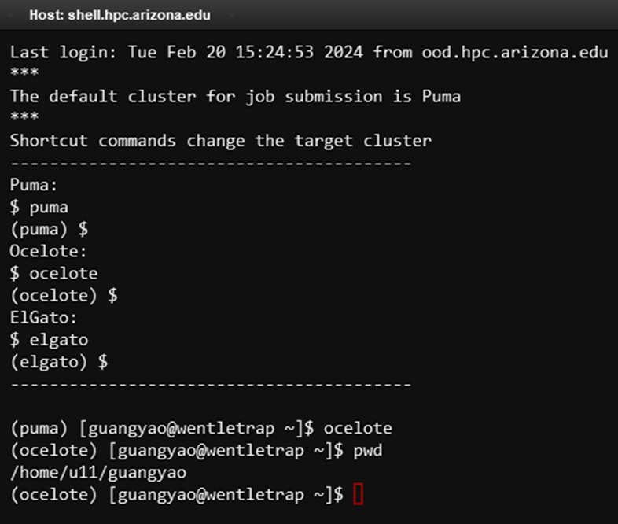{:height 447, :width 523}
-
- ## Run *fastQC* to analyze raw reads quality
	- Create the output directory that matches the output path/directory in your slurm script (e.g., `~/fastQC` in our demo code)
		- 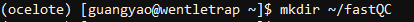
		- Q: what should be the output path/directory in HW2?
	- Copy the slurm script (fastQC.slurm in our demo) to the output directory
		- Note: you can save the slurm script elsewhere as long as you know where to find/execute it and see the *.out report afterward (the same below)
		- 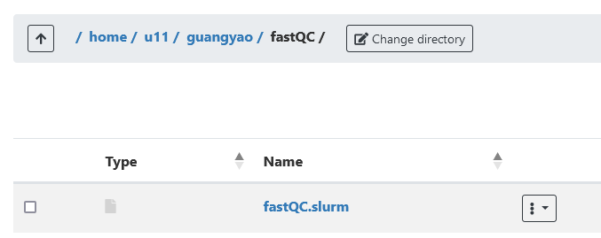{:height 187, :width 445}
	- Verify that the input-output paths/directories are valid and appropriate
		- Note: in our demo code, the input path is `/groups/guangyao/416a516a/example_fastq/REF.G0` . What should be the input path in HW2?
	- Submit (and monitor) the slurm job
		- 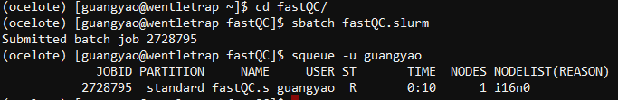{:height 96, :width 629}
	- Check the output files (as we demoed in class) after the job is complete
		- 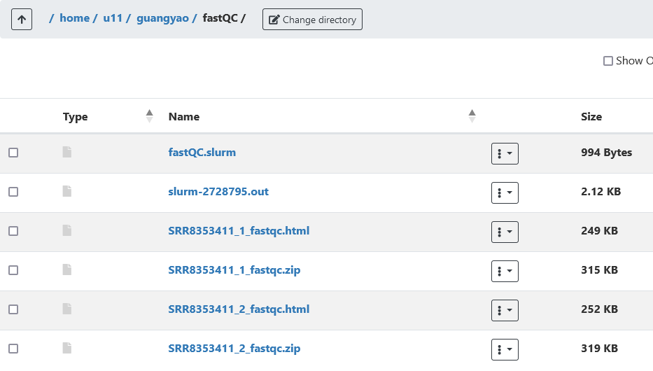{:height 382, :width 632}
-
- ## Run *fastp* to pre-process raw reads
	- Create the output directory that matches the output path/directory in your slurm script (e.g., `~/fastp` in our demo code)
		- 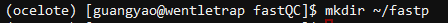
		- Q: what should be the output path/directory in HW2?
	- Copy the slurm script (fastp.slurm in our demo) to the output directory
		- 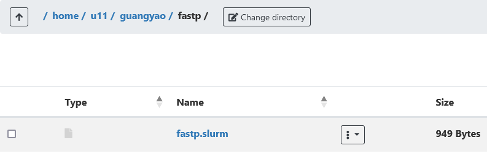{:height 176, :width 520}
	- Verify that the input-output paths/directories are valid and appropriate
		- Note: in our demo code, the input path is `/groups/guangyao/416a516a/example_fastq/REF.G0` . What should be the input path in HW2?
	- Submit (and monitor) the slurm job
		- 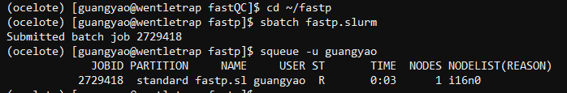{:height 115, :width 685}
	- Check the output files (as we demoed in class) after the job is complete
		- 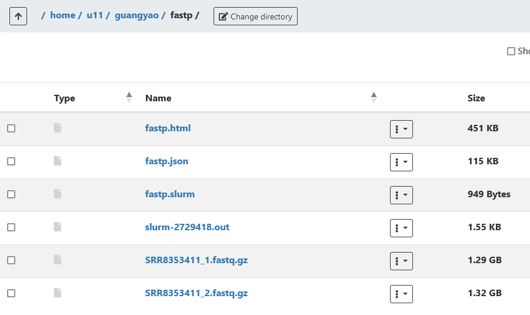{:height 402, :width 658}
-
- ## Run *STAR* to map pre-processed reads to the reference genome
	- Create the output directory that matches the output path/directory in your slurm script (e.g., `~/STAR` in our demo code)
		- 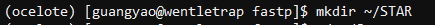
		- Q: what should be the output path/directory in HW2?
	- Copy the slurm script (Star_mapping.slurm in our demo) to the output directory
		- 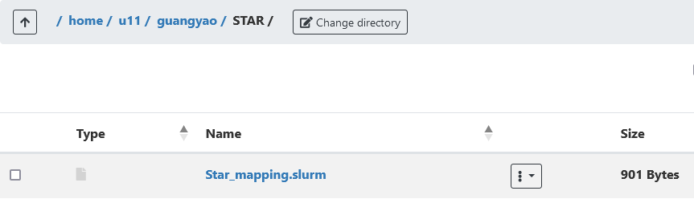{:height 187, :width 545}
	- Verify that the input-output paths/directories are valid and appropriate
		- Q: In our demo code, the input path reflects that of a standalone step. How should you modify the code to connect the input path here to the output path of the *fastp* step above? Similarly, you will point the input path of the *STAR* step to the output path of the *fastp* step in HW2.
	- Submit (and monitor) the slurm job
		- 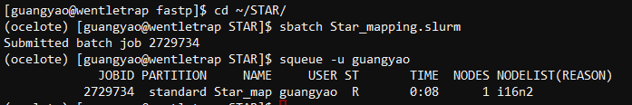{:height 123, :width 686}
	- Check the output files (as we demoed in class) after the job is complete
		- 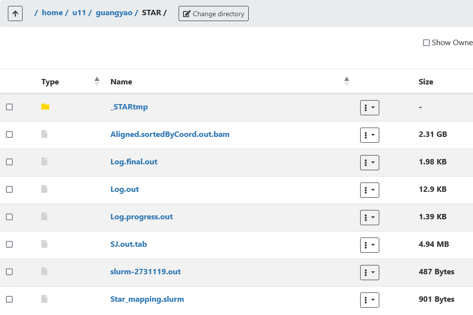{:height 472, :width 677}
-
- ## Run *featureCounts* to count the mapped reads
	- Create the output directory that matches the output path/directory in your slurm script (e.g., `~/Counts` in our demo code)
		- 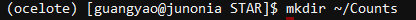{:height 48, :width 439}
		- Q: what should be the output path/directory in HW2?
	- Copy the slurm script (featureCounts.slurm in our demo) to the output directory
		- 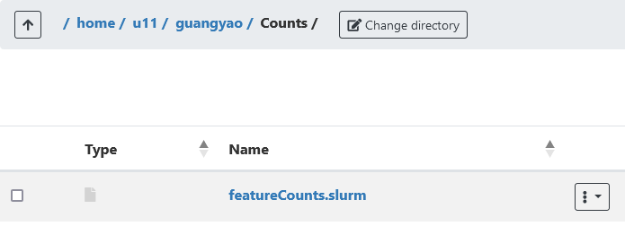{:height 206, :width 553}
	- Verify that the input-output paths/directories are valid and appropriate
		- Q: Again, check the input path in our demo code and think how should you modify it to connect to the *STAR* step above in HW2.
	- Submit (and monitor) the slurm job
		- 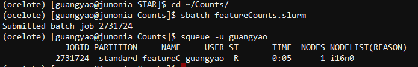
	- Check the output files (as we demoed in class) after the job is complete
		- 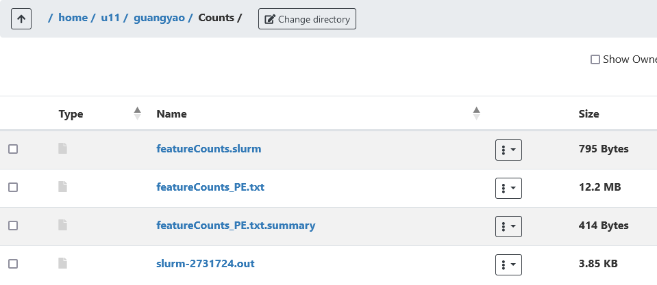{:height 324, :width 691}