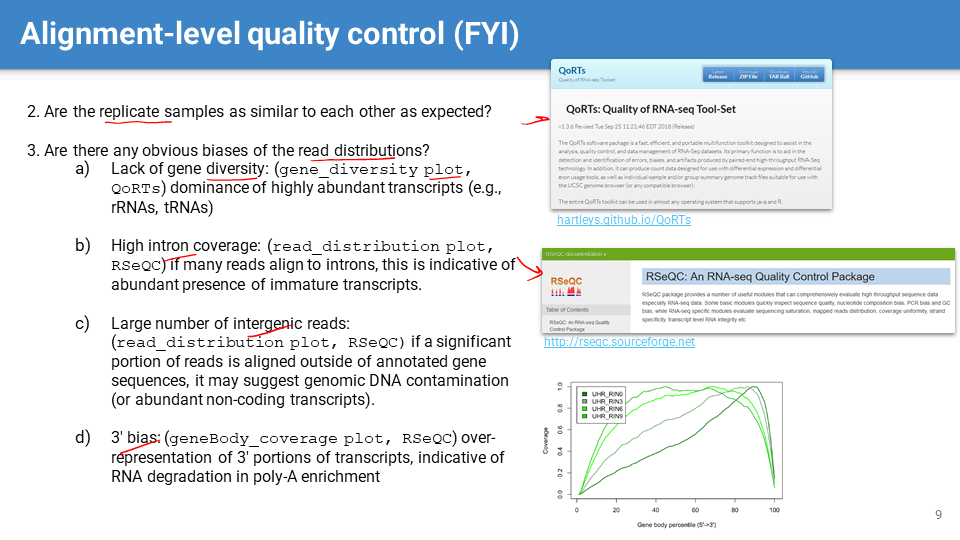

## Cont. from L10
	- 
		- example #HPC #code #SLURM
		-
	- 
		- #UQ 7
		-
	- 
		- #FASTQ #[[for loop]]
		- in addition to the two #[[for loop]] snippets shown in the slide, the following format is also correct
			- `for variable in [list]; do command; done`
		- note: use `echo` to print out intermediate results on HPC to check your #code
		-
	- 
		- #fastp #[[for loop]]
		- Note: Lines 6 and 7 belong to the same line of text (with text wrapping).
		-
	-  #Slido
		- Answer: all lines 1-9 in the example code are correct
		-
	- 
	- 
		- (#SAMtools can be used for filtering alignments based on mapping quality etc. (values of various fields) in SAM/BAM files)
	-
	- 
	- 
		- Quality control (#QC) of aligned reads:
			- By reviewing statistics generated by the aligner (e.g., STAR's Log.final.out) to understand the alignment outcome and efficacy.
			- By visualizing the alignment in a genome context using tools like IGV (Integrative Genomics Viewer) to assess alignment quality.
			- (Using tools such as QoRTs and RSeQC to generate visualizations like gene_diversity_plot, read_distribution_plot, and geneBody_coverage_plot to assess various aspects of the alignment quality.)
		-
- # Section 8: Counting aligned reads
	- 
		- raw #reads -> preprocessing & alignment -> #[[aligned reads]] -> counting #[[assigned reads]] (i.e., those uniquely assigned to genes) -> #counts -> normalization
		-
	- 
		- #transcripts vs. genes: transcript sequences are not equivalent to gene sequences due to alternative splicing, RNA editing etc., leading to multiple #isoforms
			- Transcript-level analysis is more complex than gene-level due to the existence of multiple isoforms and the complexity of reconstructing the gene model (i.e., #[[transcriptome assembly]] ) from data.
		-
	- 
		- reads mapping to a single gene are counted, while reads that map to multiple genes are usually discarded to avoid ambiguity in gene expression estimation.
		-
	- 
	- 
		- #featureCounts #SLURM
			- featureCounts is a highly efficient program for counting reads mapping to genomic features such as genes or exons.
			- Lines 20 and 32 show how to use featureCounts to handle multiple input BAM/SAM files
				- note that STAR & fastp programs don’t have this native function to handle multiple input files (and thus need a #[[for loop]] )
				-
	- 
	- 
		- #featureCounts output files -> #[[counts table]]
			- Note: download the files and then open with Excel to see the counts column(s)
	-
- # Section 9: Counts normalization
	- 
		- read #counts are not equivalent to gene expression levels.
		- counts #normalization is necessary to eliminate systematic effects on read counts (e.g., differences in library size, RNA composition, batch effects, and other technical variations) that are not associated with gene expression. This allows for proper comparison of read counts across different samples.
		-
	- 