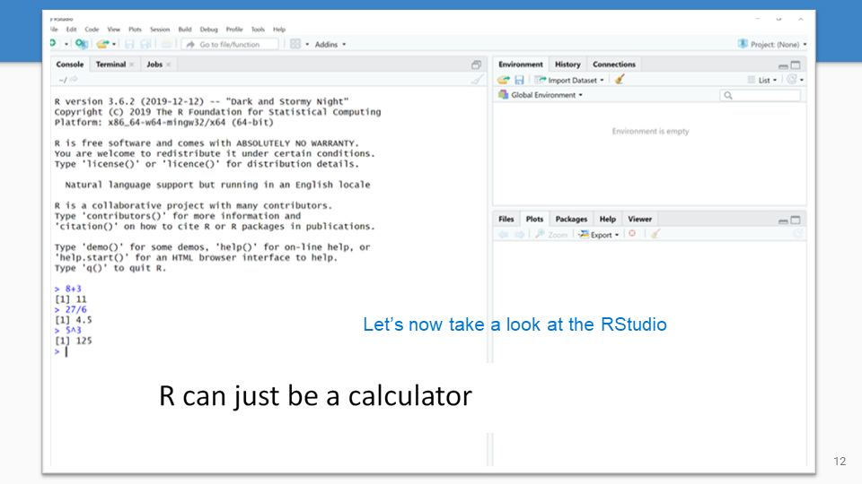
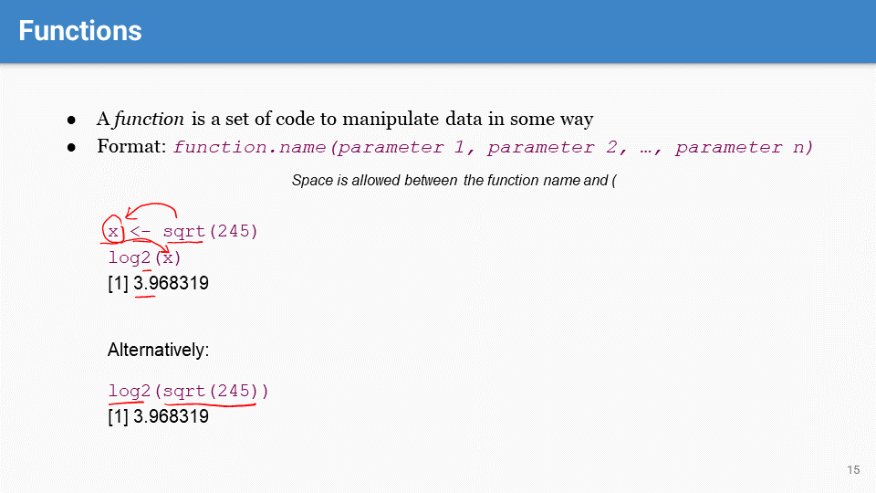

## Cont. from L12
	- 
		- If you cannot access #HPC via #OnDemand, try the following (in order):
			- Clear the cache in your brower
			- Try a different brower(s)
			- Access HPC via client programs (e.g., PuTTY in Windows, Terminal in Mac), instead of OnDemand
			- Contact HPC support: hpc-consult@list.arizona.edu
		-
	-  #HW2
	-
	- 
		- Note the updated #UQ & #Quiz rules
		-
	- 
		- 
			- course #resources
			-
	-  #UQ
	-
	-  #UQ
	-
- # Section 10: R basics
	- 
	- 
	- 
	- 
		- #R & #RStudio installation
		-
	- 
		- #RStudio is an Integrated Development Environment (IDE), providing a user-friendly interface for working with #R programming. It consists of four panels:
			- **Source** (Top-Left Panel): the script editor, where you can write and edit extensive R code, save, and execute it in chunks or as a whole.
			- **Console** (Bottom-Left Panel): where the R code generates output (results, messages, warnings/errors). You can also type commands directly into the console and see the output below your command.
			- **Environment**/**History** (Top-Right Panel):
				- The Environment tab displays a list of variables, data frames, vectors, functions, and other objects currently in memory.
				- The History tab keeps a record of all the commands that have been entered in the console, from which you can search and re-run commands.
			- **Files/Plots/Packages/Help/Viewer** (Bottom-Right Panel):
				- The *Files* tab allows you to navigate your project's directories and open scripts or data files directly in RStudio.
				- The *Plots* tab shows the graphical output from R commands. You can zoom in on these plots, export them to various formats, and navigate through a history of plots you've created.
				- The *Packages* tab lists all installed packages and lets you install new packages or load/unload them from the current session.
				- The *Help* tab provides access to R documentation and help files for different functions and packages.
				- The *Viewer* tab is used to display local web content, such as HTML files, which can be particularly useful for viewing R Markdown documents or Shiny apps directly within RStudio.
	-
	- 
		- A #variable is used to store data in R. There are conventions and syntax rules to follow, as explained in the slide, to create variables.
		-
	-  #Slido
	-
	- 
		- A #function is a piece of R code designed to carry out a specific task and can be reused throughout the code.
			- The syntax for using a function: the function name followed by parentheses containing any #arguments or #parameters the function requires.
				- *Parameters* refer to the variables as they are named in the function's definition.
				- *Arguments* refer to the actual values or expressions you pass to (and processed by) the function when you call it.
			- Examples: the sqrt() function, which calculates the square root, and log2(), which calculates the binary logarithm.
			- Also note the syntax for nesting functions: e.g.,  log2(sqrt(245)).
		-
	- 
		- 
			- to access the #help documentation in R: use `help(function_name)` or `?function_name`
			   retrieves the function description, parameters, and examples.
			- use the `help.search()` function or the `??` shortcut in R to find functions related to a certain topic when you do not know the exact function name
			-
	- 
		- A #vector in R is a one-dimensional array that can hold numeric, character, or logical data. All elements in a vector must be of the same type.
		-
	-  #Slido
		- 
		- If you do not enclose #string elements in #quotes, R will look for an object/variable with that name. Since there is no object named castaneus, R returns an error saying "object 'castaneus' not found."
		-
	-  #Slido
		- In this example, the object/variable *castaneus* is defined first, and thus no error is returned when passing it into the vector *mouse.strains*
-