-
	-  #Quiz 2, #HW2, #[[516a project]]
	-
	- 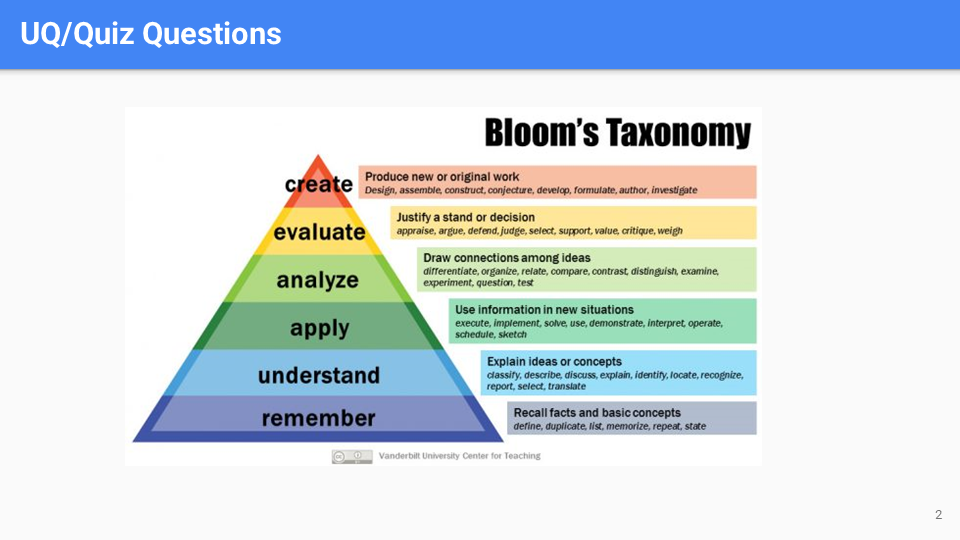
		- 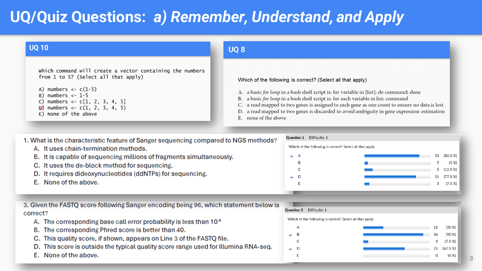
		- 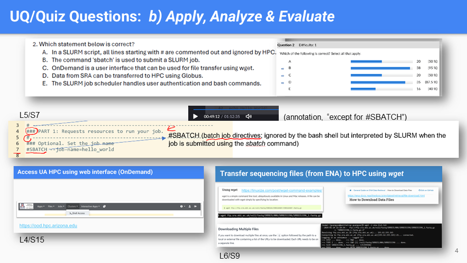
		- 
		- 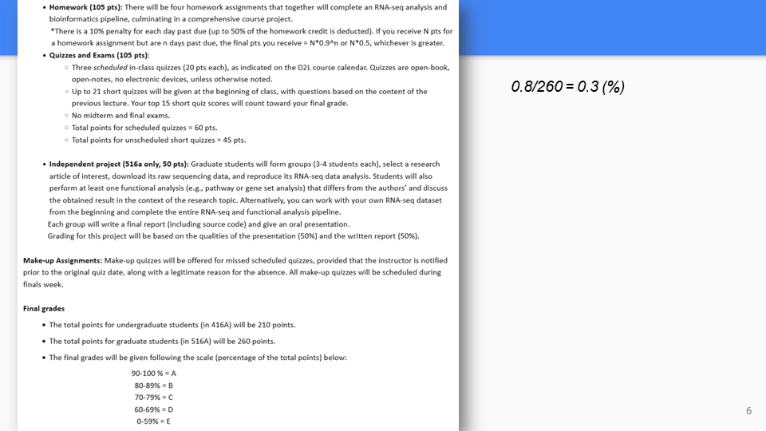
		- #UQ #Quiz questions can be categorized into two types and levels according to #Bloom's Taxonomy:
			- Level 1: Remember, Understand, and Apply (fundamental/straightforward)
			- Level 2: Apply, Analyze, and Evaluate (knowledge assembly/synthesis)
			- See example questions for detail
			-
	-  #UQ
	-
	- ## 10.4: Vectors (cont.)
	- 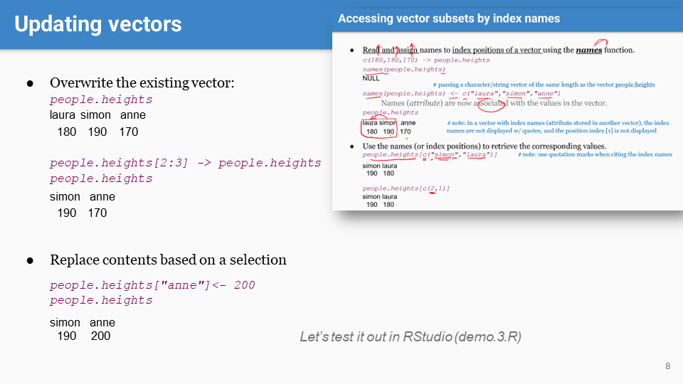
		- #update a #vector in R:
			- overwrite an existing vector by assigning new values to the same variable name.
			- replace specific contents of a vector using vector indexing
	-
	- 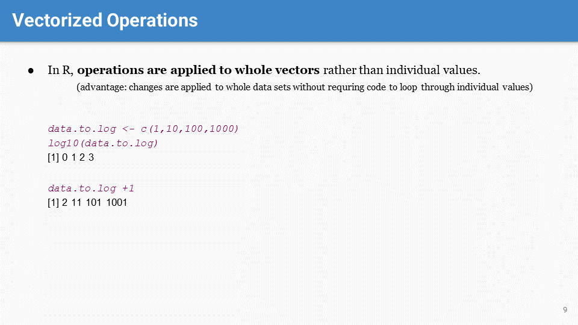
		- #vectorization in R: operations are applied to entire vectors at once rather than looping through individual elements.
		-
	- 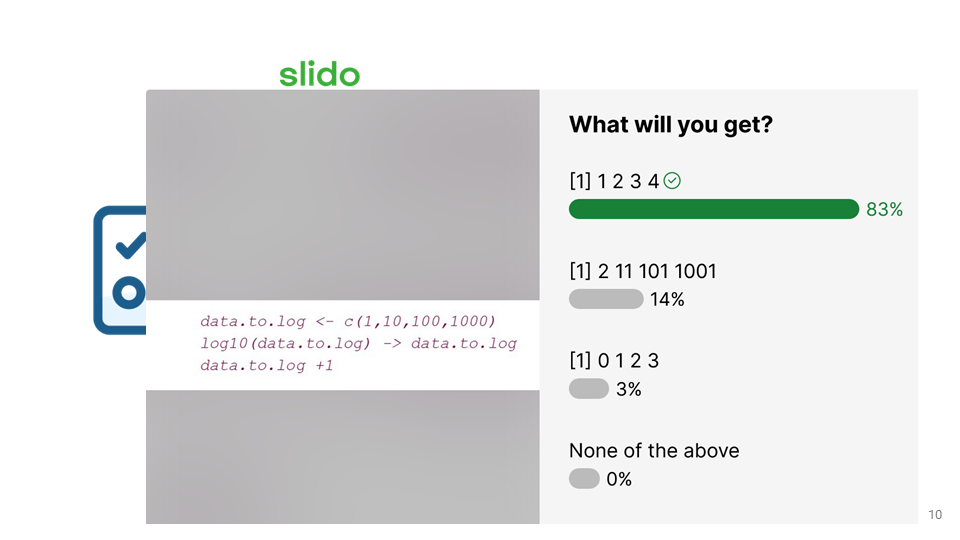 #Slido
	-
	- 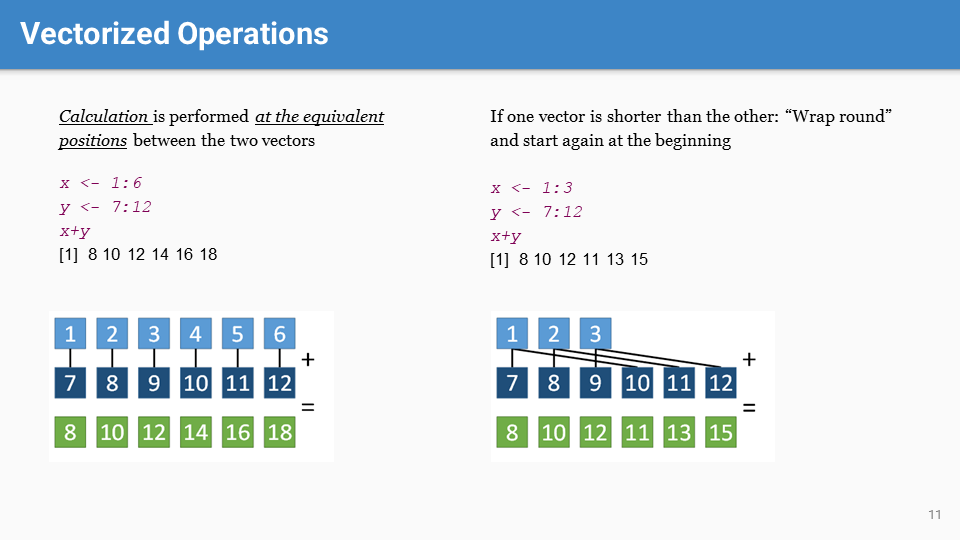
		- 
		- #vector calculations between two vectors:
			- When one vector is shorter, it gets recycled from the beginning to match the length of the longer one.
			- If the longer vector's length isn't a multiple of the shorter vector's length, the calculation is still performed by recycling the shorter vector (up to the last element of the longer vector), but the mismatch is noted and a warning is issued.
		-
	- 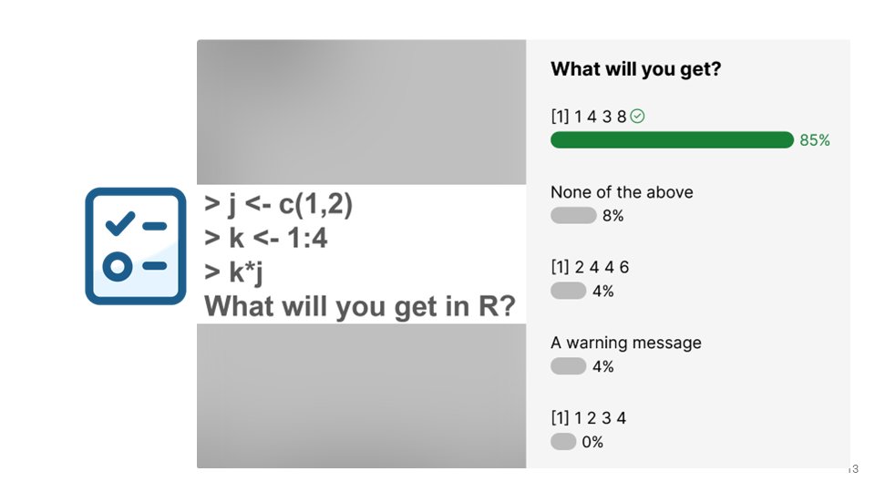 #Slido
	-
	- ## 10.5: Data Frame
	- 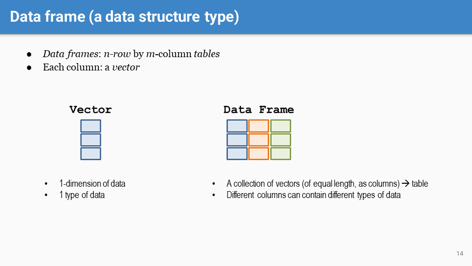
		- A #vector is 1-dimensional, containing one type of data.
		- A #[[data frame]] is 2-dimensional, containing a collection of vectors of equal length as columns. Each column can contain a different type of data, such as numeric, text strings, etc.
		-
	- 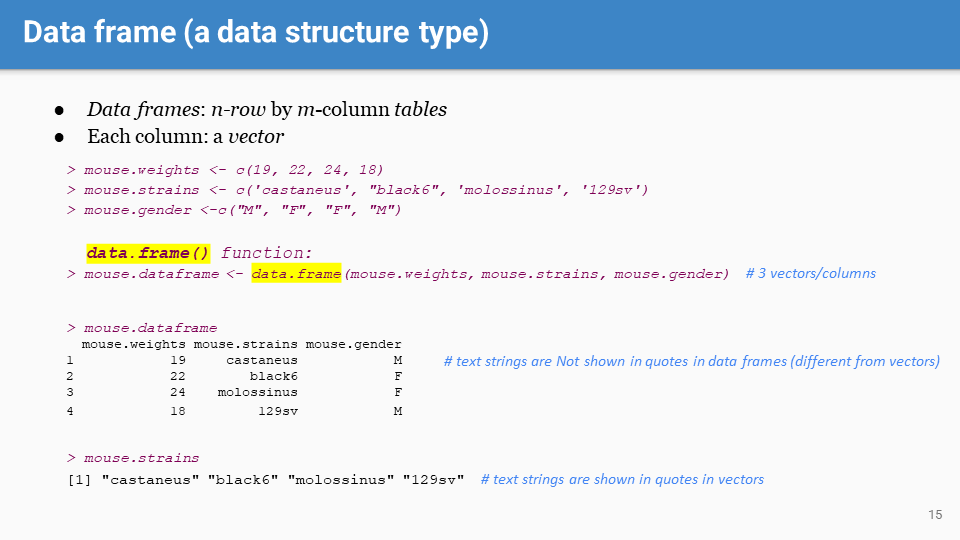
		- A #[[data frame]] can be created in R using the `data.frame()` function
		- Note that text #strings within data frames are not shown with quotes (different from strings in vectors).
		-
	- 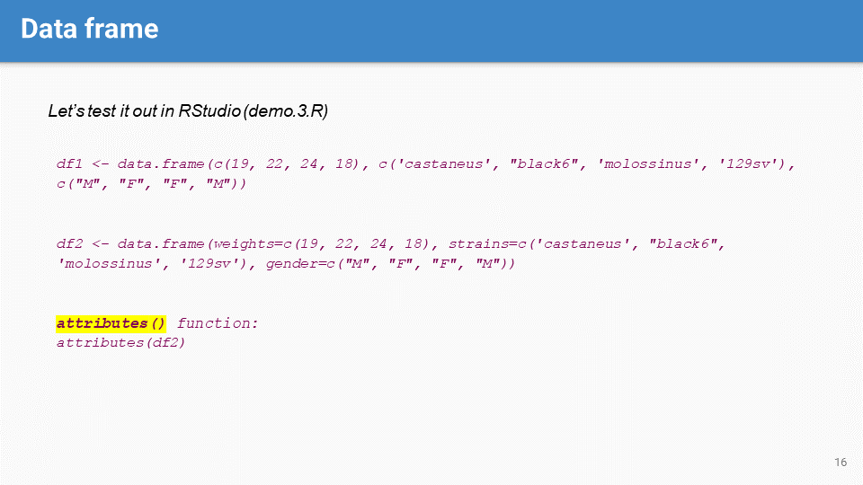
		- Note the two different ways to assign values and column names when creating a #[[data frame]] (examples in df1 and df2).
		- The `attributes()` function can be used to show the #metadata of a #[[data frame]]
			- `rownames()`, `row.names()`: to access/change row names
			- `colnames()`, `names()`: to access/change column names
		-
	- 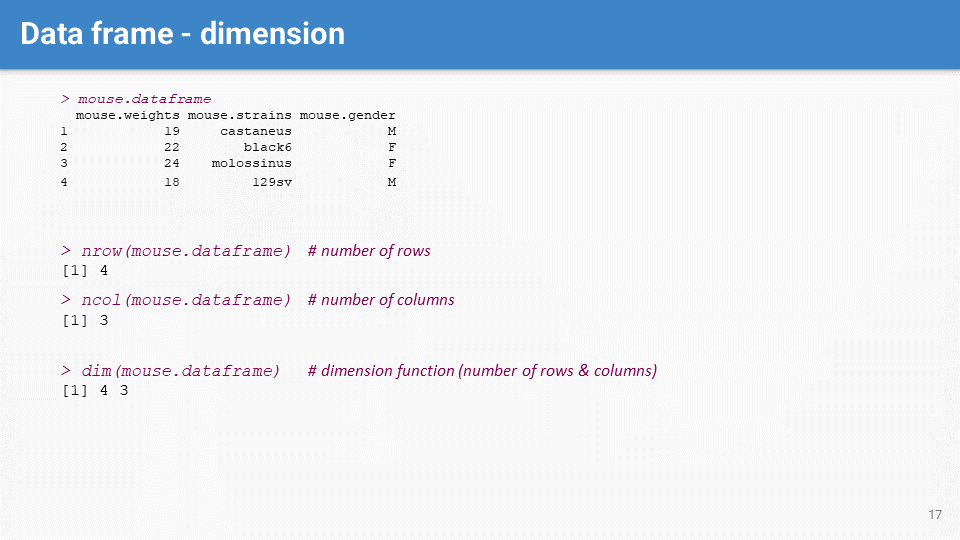
		- Ways to retrieve the dimensions of a #[[data frame]] with `nrow()`, `ncol()`, and `dim()` functions, which return the number of rows, number of columns, and overall dimensions respectively.
		- Understanding the size and #dimension of a data frame is crucial for data manipulation.
		-
	- 
		- Ways to extract #subsets of data from a #[[data frame]] using different indexing methods.
			- extract a single #column -> #vector format
				- using the $ sign followed by the column name
				- using double brackets with the column's index.
			- extract a #subset of a data frame -> #[[data frame]] format
				- using a single bracket with the index of selected column(s).