-
	- 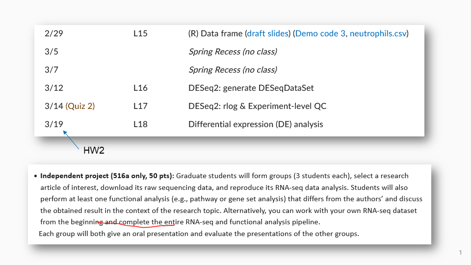
	-  #UQ
	-
- ## 10.5: Data Frame (cont.)
	- 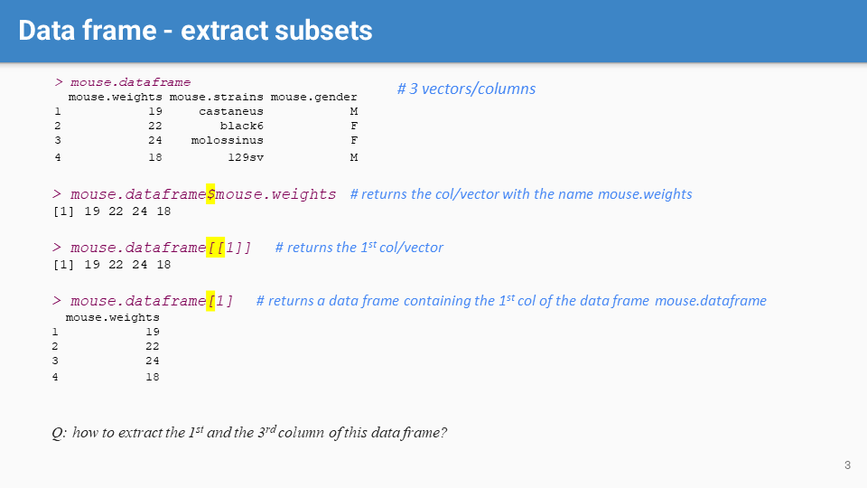
		- #[[data frame]] name followed by `$column-name` or `[[column#]]` extracts and returns the corresponding column as a #vector, stripping the data frame structure
		- #[[data frame]] name followed by `[column#]` extracts and returns the corresponding column(s) in the #[[data frame]] structure
			- to extract the 1st and 3rd columns: `mouse.dataframe[c(1,3)]`
			-
	- 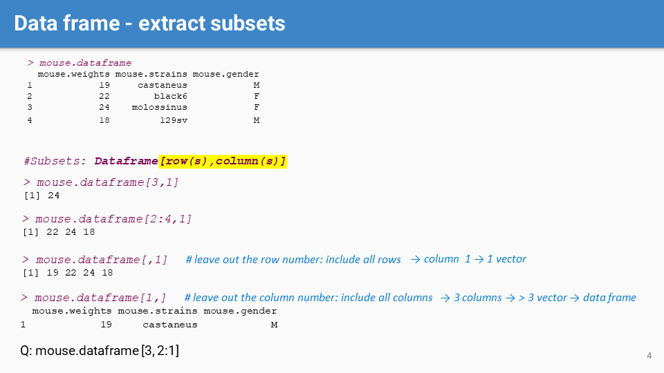
		- #[[data frame]] name followed by `[*,*]` (with `,` in the bracket) returns either a #vector (if the resultant subset is 1-dimensional coming from one column) or a #[[data frame]] (if the resultant subset is 2-dimensional coming from more than one column)
		-
	- 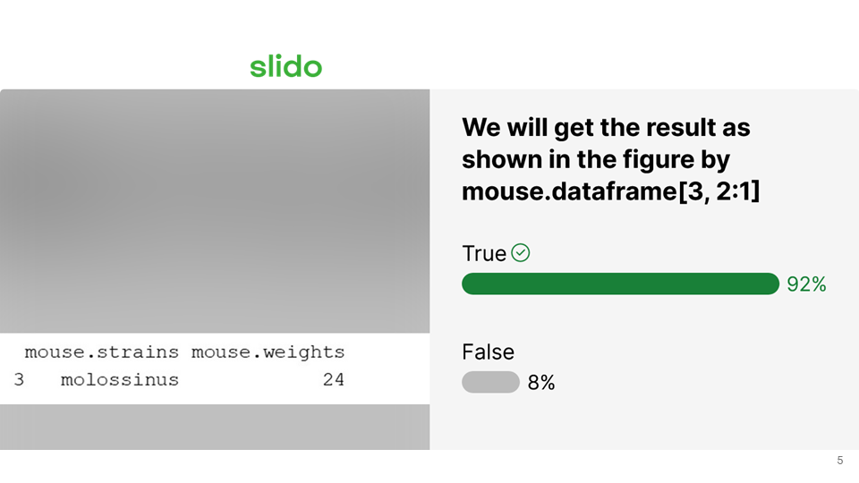 #Slido
	-
	- 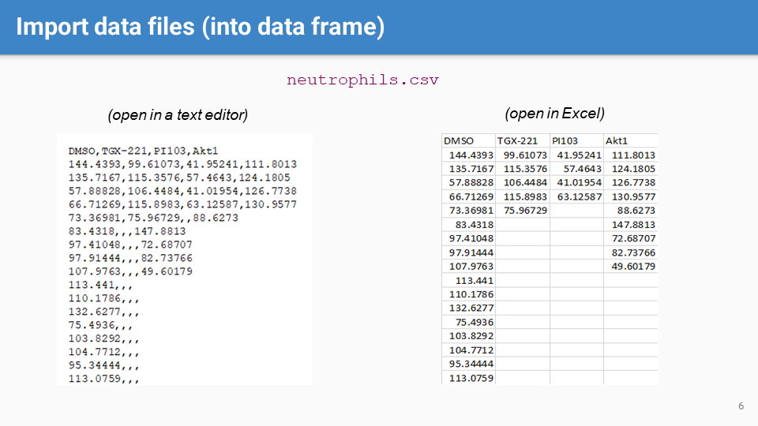
		- The example csv file is available on the D2L course calendar page
		-
	- 
		- #getwd() is a function that prints the current working directory, which is the folder where RStudio is currently operating. This is important for locating files that you want to #read into R or where you want to #write output files.
		- #setwd() is a function used to change the current working directory to a directory specified by the user. The path must be a #string and is system-specific (different syntax for Windows, macOS, Linux).
			- You can also use  `Choose Directory` in RStudio menu to set the working directory
			-
	- 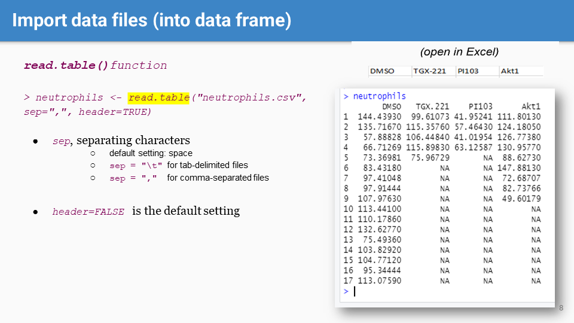
		- #read.table() is a function that reads data from a #file into a #[[data frame]]. The important arguments shown are file (file name in a string), sep, and header. `sep` defines the delimiter that separates the values in your data file. `header` indicates whether the first row of the file contains the column names (which you can check with Excel before import).
		-
	- 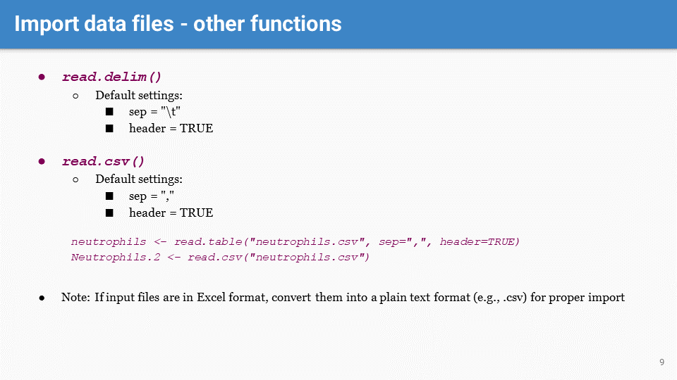
		- #read.delim() and #read.csv() are specialized versions of #read.table() that have preset arguments for reading tab-delimited and comma-separated values, respectively.
		- Note that none of the three read.table functions can directly import Excel files, which need to be saved as a text format, like .csv, for proper import.
		-
	- 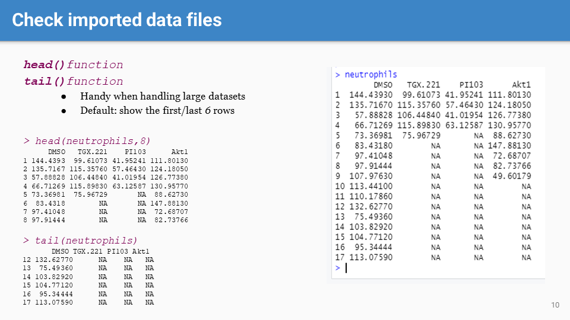
		- #head() and #tail() functions display the first and last parts of the #[[data frame]]. They can be used for verifying whether the data looks as expected after import, without the need to view the entire large dataset.
		- Note that missing values are shown as `NA` after import into a #[[data frame]]
		-
	- 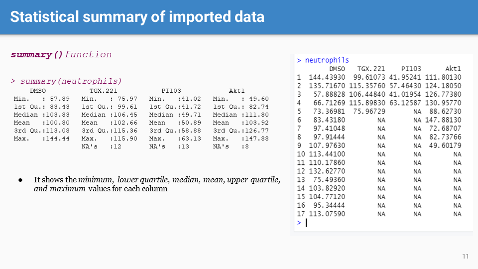
		- The #summary() function gives a quick overview of the data, providing key statistics that helps understand the distribution of the dataset.
		-
	- 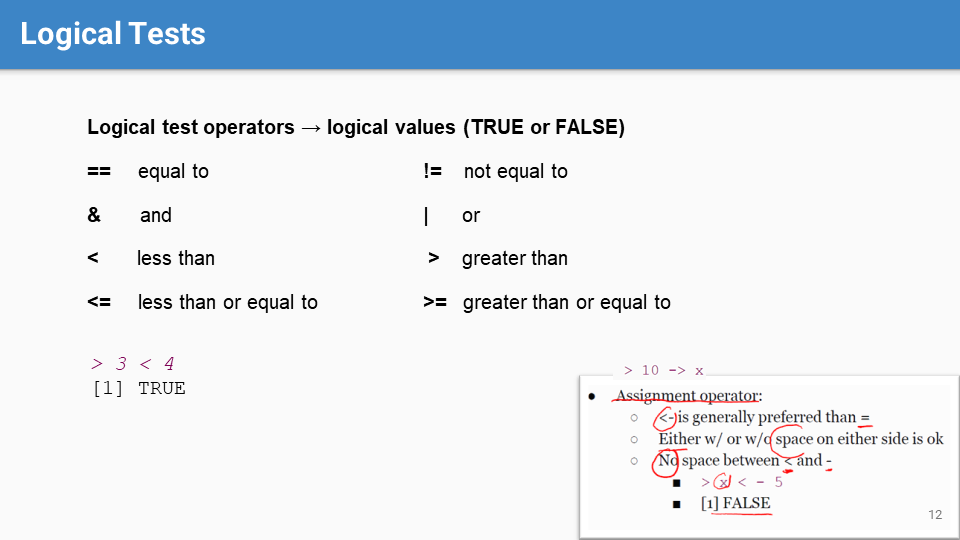
		- #logical operators in R allow us to make data comparisons and logical tests that return TRUE or FALSE values.
		-
	- 
		- 
		- The #subset() function can be used to filter rows in a #[[data frame]] based on a logical condition.
			- e.g., the #logical condition `abs(TGX.221-DMSO)>20` filters the data based on the absolute difference between values in the two columns (TGX.221 and DMSO) being greater than 20; those #rows (with the logical condition being #TRUE ) are kept in the resulting subset.
			- The #select rrgument, e.g., `select=c(Akt1,DMSO)`, specifies which #columns to keep in the resulting subset.
		- Note that in R, mathematical calculations involving `NA` result in `NA` (that is, any calculation involving an unknown value remains unknown, unless `na.rm = TRUE` is specified as we will see in the next lecture)
-
- ## 10.6: Graphs in R
	- 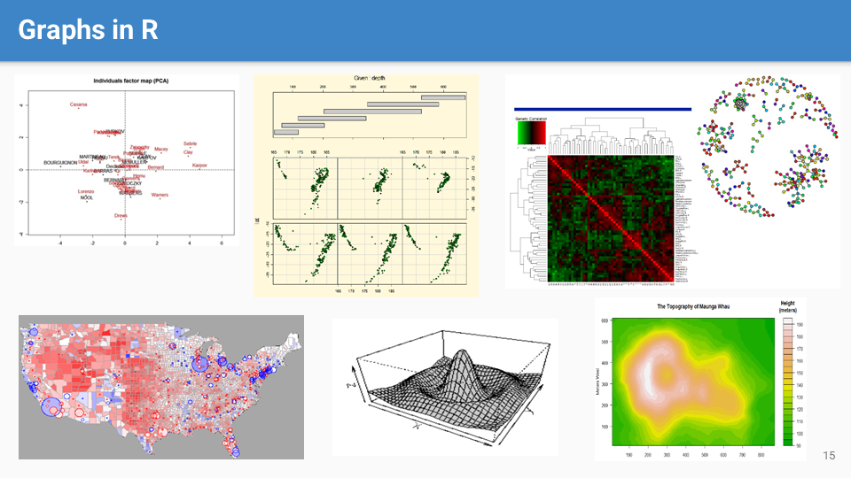
	- 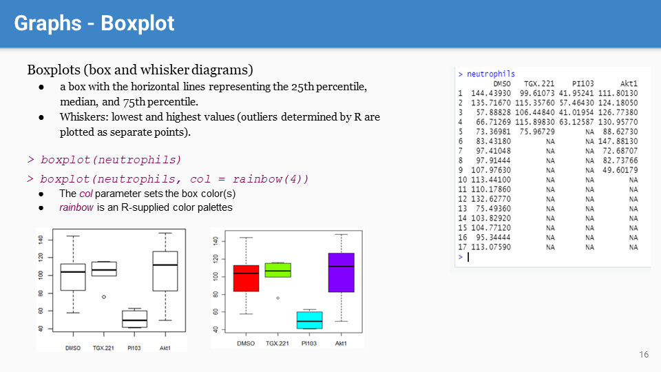
		- A boxplot in R can be created using the #boxplot() function, with customization options like the col parameter to color the boxes.