-
	- 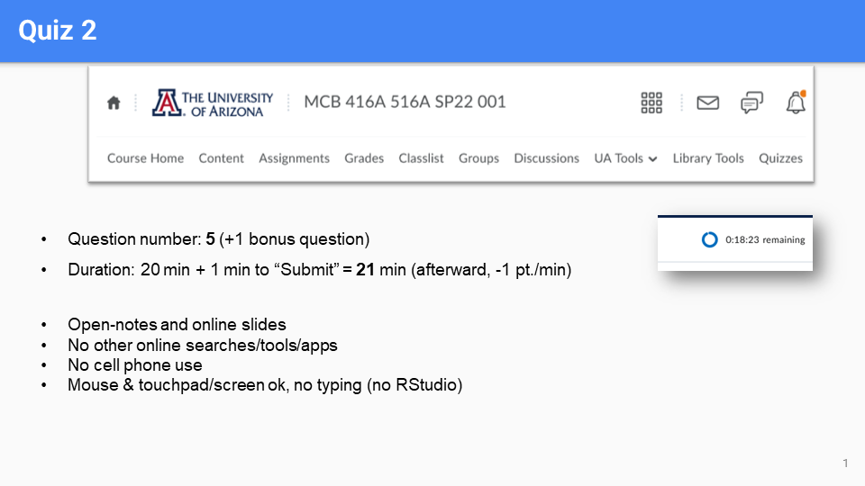 #Quiz 2
	-
- ## 10.6: Graphs in R (cont.)
	- 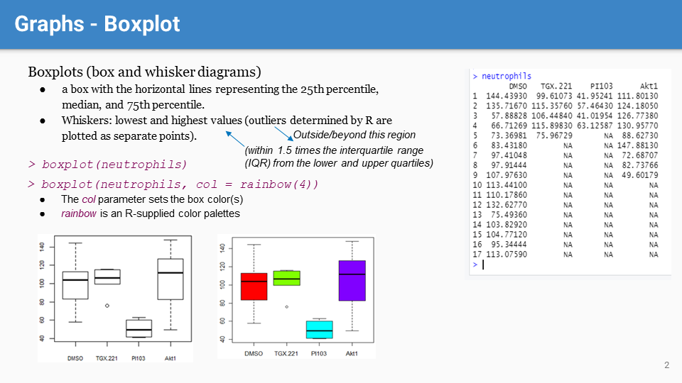
		- #boxplot() displays the distribution of data based on a five-number summary: minimum, first quartile (Q1), median, third quartile (Q3), and maximum.
		-
	- 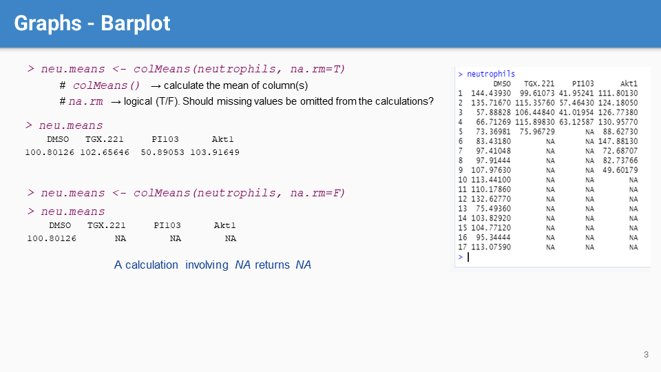
		- 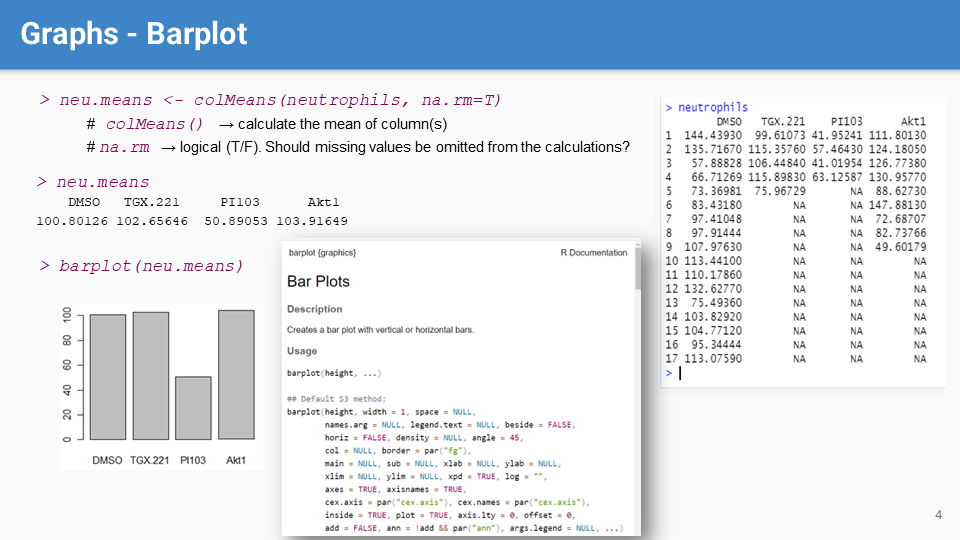
		- #barplot() displays the distribution of data with rectangular bars representing the data's value or frequency (in this example, colMean values)
		- Note that #NA values are skipped with na.rm=T. If set to False (na.rm=F), calculations in R involving NA would return NA (unless otherwise noted).
		-
	- 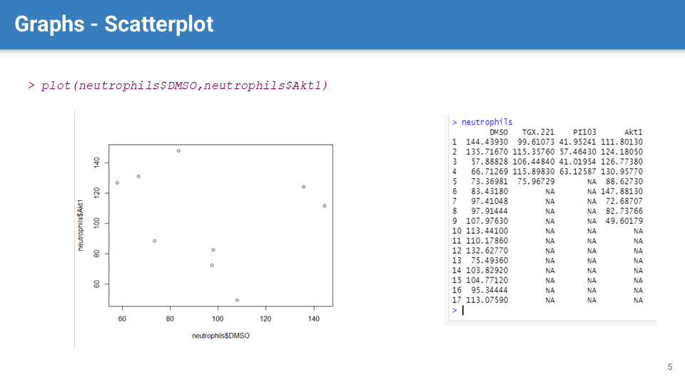
		- #scatterplot displays data points on a horizontal and a vertical axis, based on data taken from the 1st and 2nd arguments in the #plot() function.
		-
	- 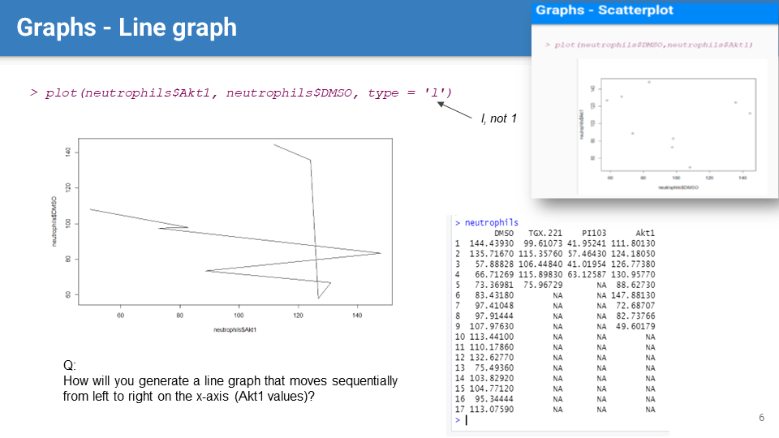
		- 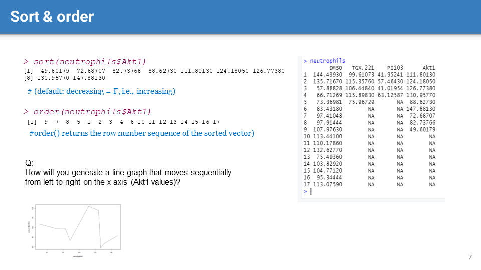
		- 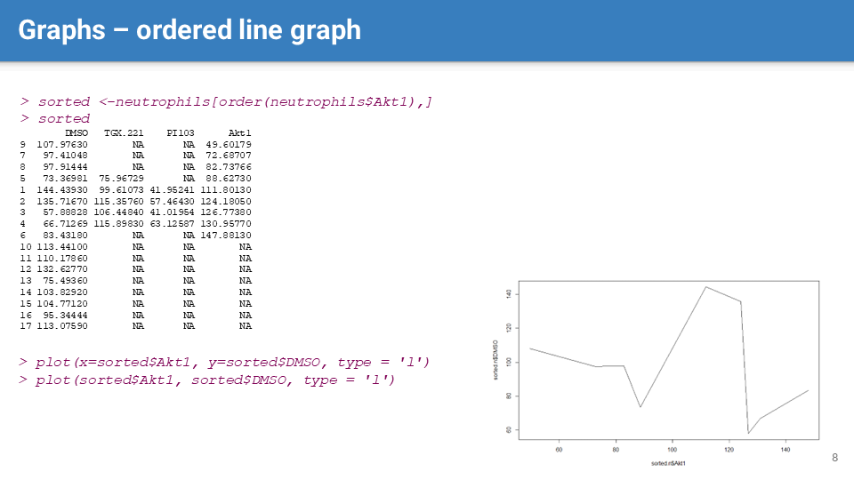
		- To achieve a sequential #[[line graph]], data need to be ordered by the x-axis values (in this example, the Akt1 values) before plotting
		- #sort() returns the sorted values, while #order() returns the row indices of the sorted vector (Akt1 column in this example).
		- In this example, we first use the order() function to get the row indices of the sorted Akt1 column. We then use these row indices to generate a sorted table (i.e., data frame `sorted`) and plot the line graph accordingly.
	-
	- 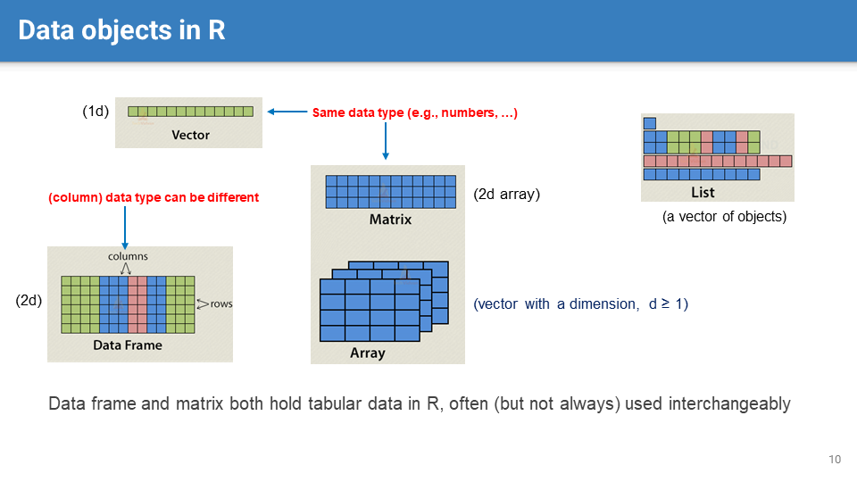
		- FYI. We will focus on using vector and data frame in this course.
	-
- # Section 11: DESeq2
	- 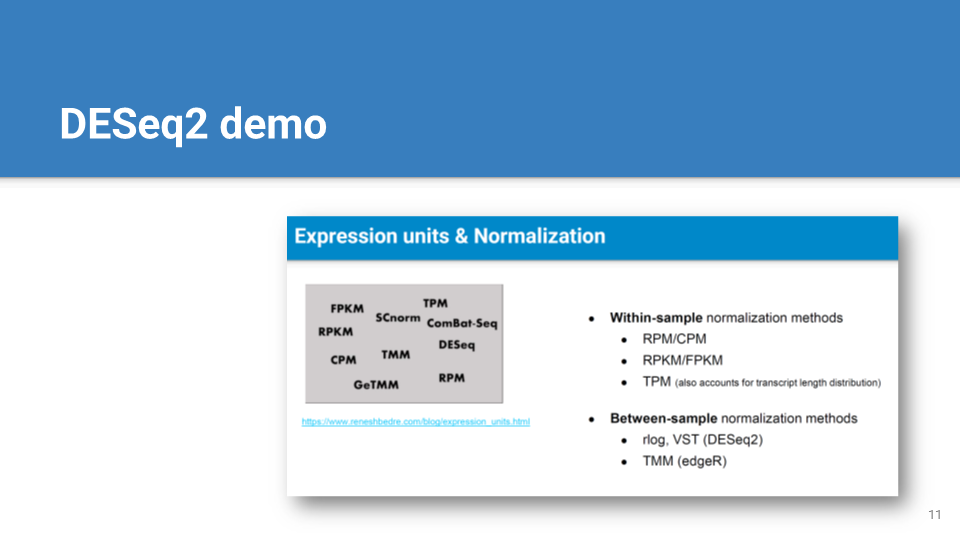
	-
- ## 11.1 DESeq2 installation
	- 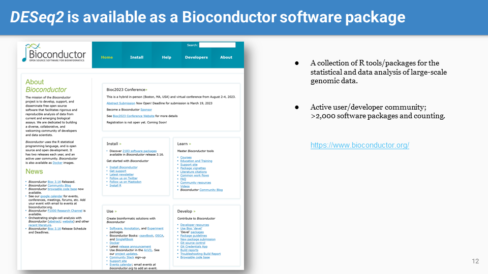
	- 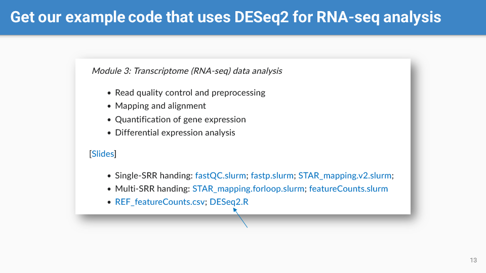 #code
	-
	- 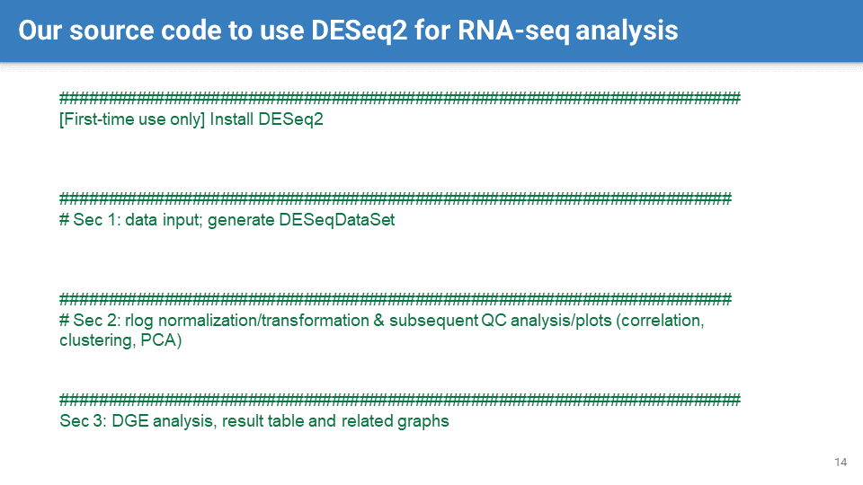
	- 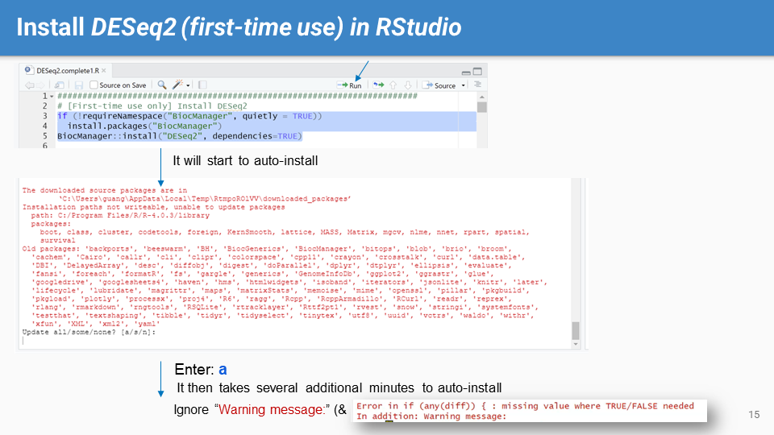
		- We need to #install #DESeq2 the first-time to use it in RStudio. It involves the following steps:
			- Checking if the `BiocManager` package is installed, as it is the preferred way to install #Bioconductor packages.
			- Using `BiocManager::install("DESeq2")` to install DESeq2, with `dependencies=TRUE` to ensure all necessary dependencies are also installed.
	-
- ## 11.2 DESeqDataSet object
	- 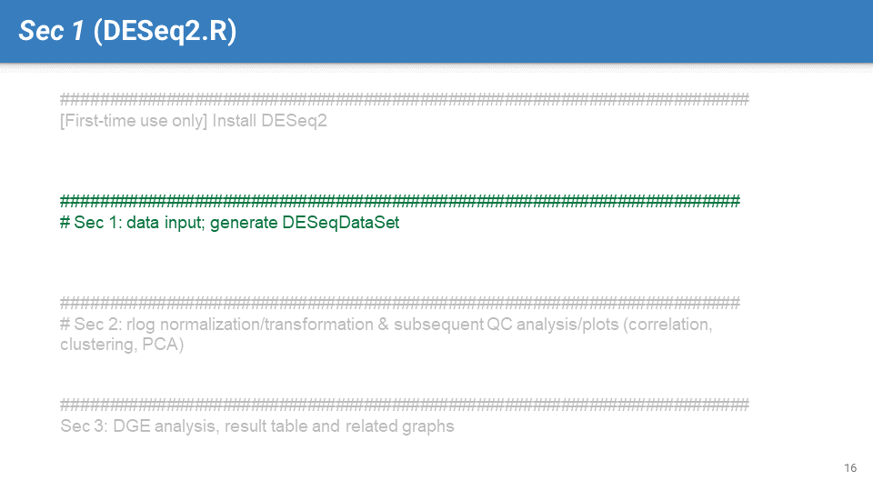
	- 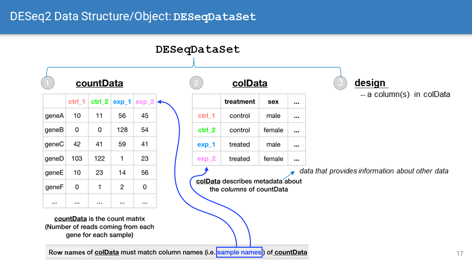
		- `DESeqDataSet` is the primary data structure used by the DESeq2 package. It consists of three main components:
		  id:: 65fa4a41-c4af-4a33-9c1e-937534792639
			- `countData`: A #[[data frame]] containing the raw counts of sequencing reads for each gene (rows) across different samples (columns).
			- `colData`: A #[[data frame]] containing the #metadata for each sample (e.g., experimental conditions, etc.) #Row names in `colData` must correspond to #column names in `countData`.
			- `design`: A formula that represents the experimental design. It's used to specify how the count data depends on the variables (column(s)) in `colData`.
		- This structure allows DESeq2 to fit a model to the count data while accounting for the experimental conditions, enabling downstream analysis (e.g., the identification of differentially expressed genes).