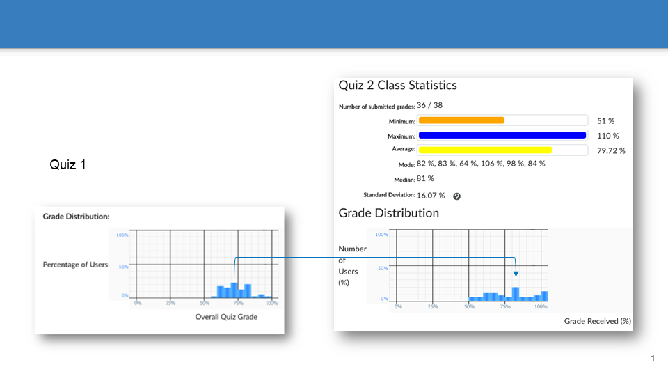
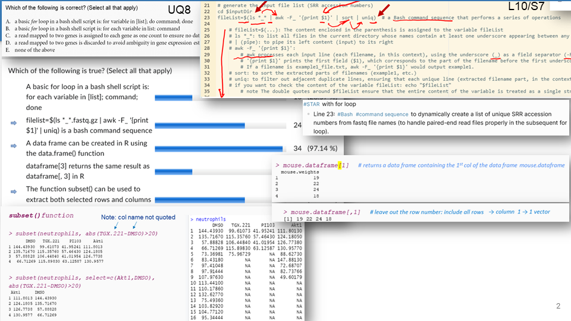
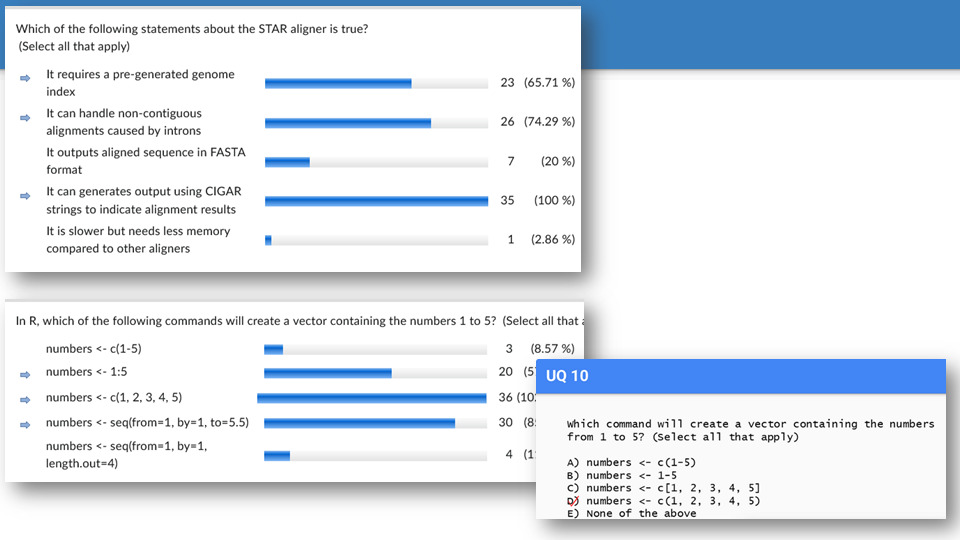
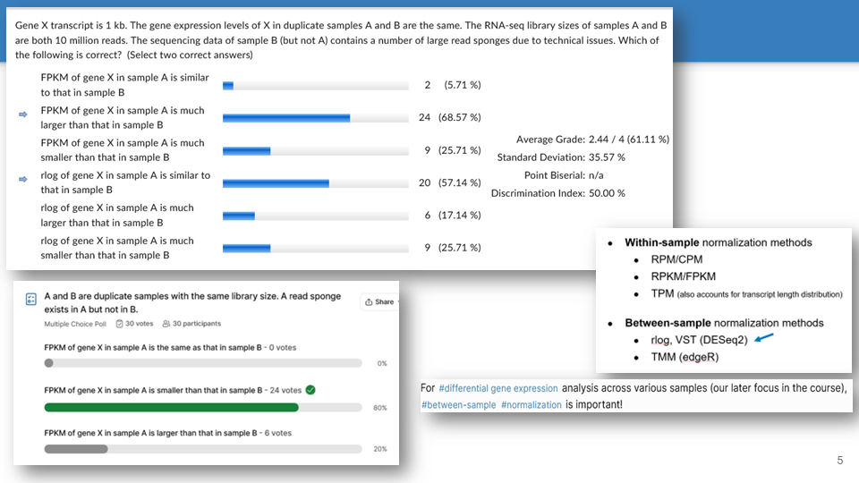
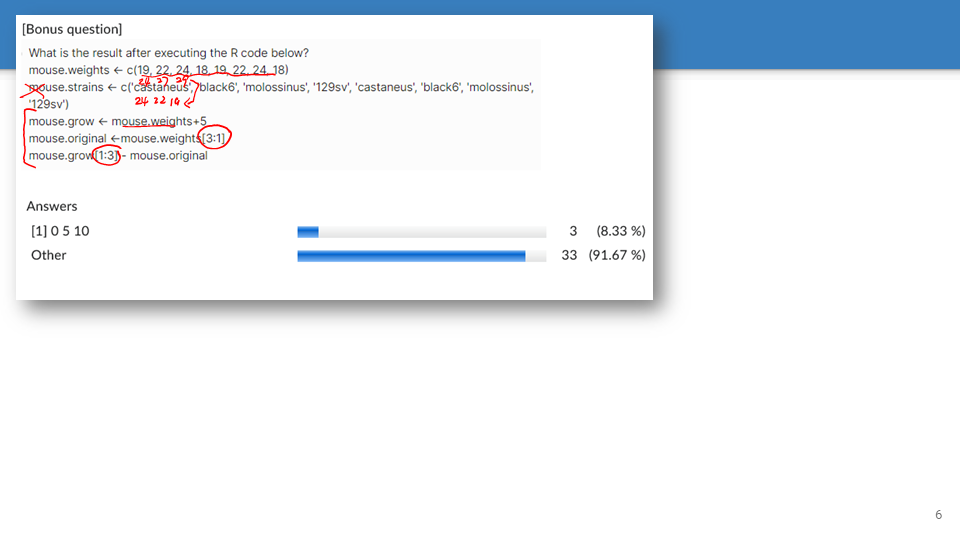
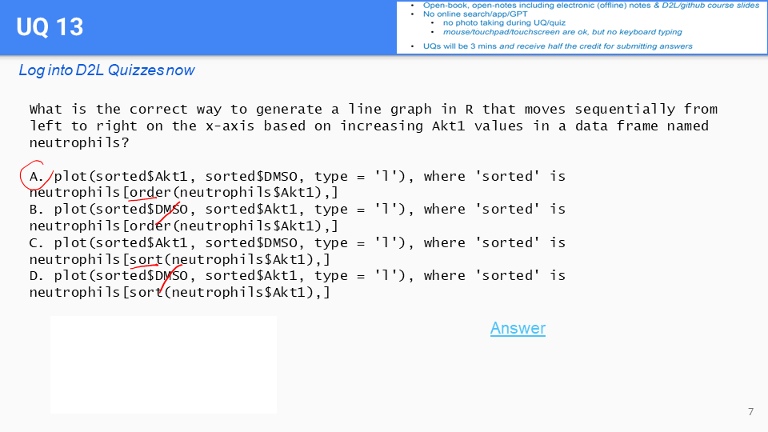
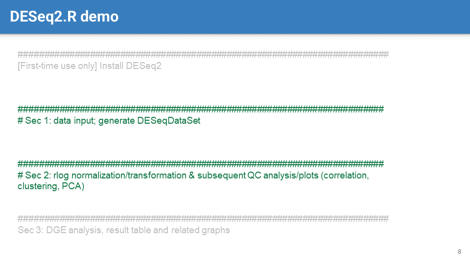
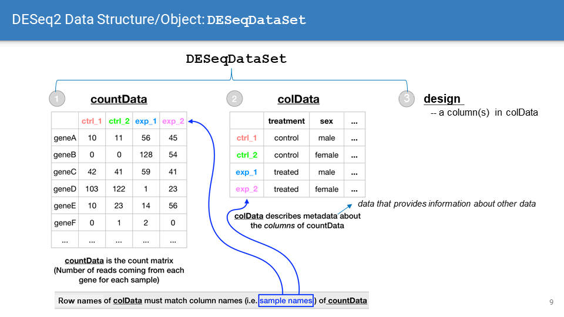
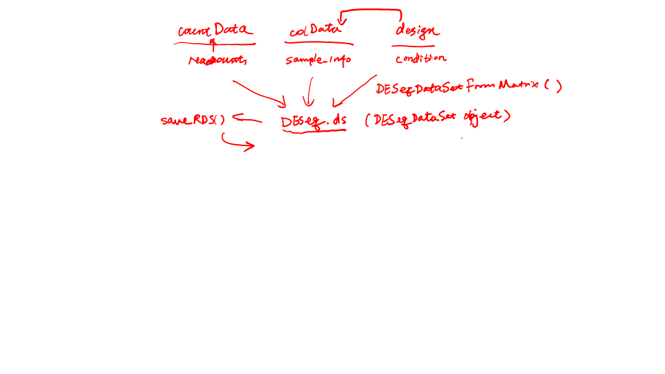
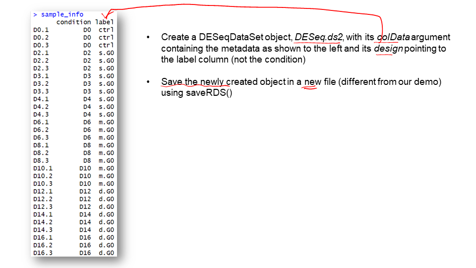

-
	- 
		- 
		- 
		- 
		- 
		- 
		- #Quiz 2 explanations
		-
	-  #UQ
	-
- ## 11.2 DESeqDataSet object (cont.)
	- 
	- 
		- {{embed ((65fa4a41-c4af-4a33-9c1e-937534792639))}}
		-
		- 
		- Note: see our example #code, DESeq2.v2, for line-by-line annotations
		-
	- 