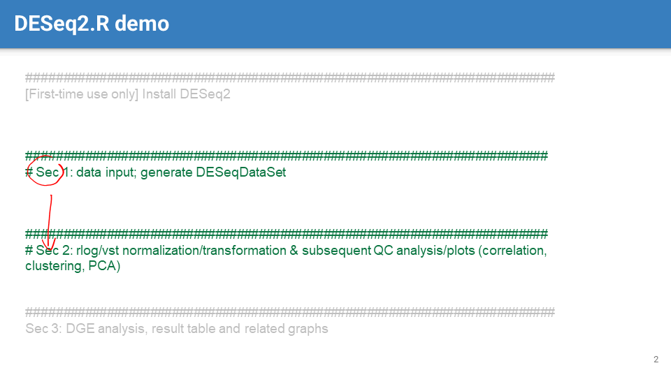

-
	- 
	- 
	-  #UQ
		- Note that row names are not data columns
	-
- ## 11.2 DESeqDataSet object (cont.)
	- 
		- 
	- 
		- Currently, examples of popular AI large language models (#LLMs ) include the following:
			- GPT-4 (chatGPT plus, paid), chatGPT (3.5, free) [openAI]
			- Claude 3 Opus (paid), Sonnet (free), and Haiku (free) [Anthropic]
			- Copilot (GPT-4 Turbo, free), Copilot Pro (paid) [Microsoft]
			- Gemini/Bard (free and paid versions) [Google]
			-
	- 
		- Note the #prompt example of using #LLMs to generate R code
		-
	- 
		- Example of using #LLMs to explain R code
		-
	- 
		- Example of using #LLMs to check and troubleshoot code
		- You can use #LLMs as versatile helpers, but be aware that their answers are not always correct.
	-
- ## 11.3 rlog and vst normalization
	- 
		- the #rlog function from the #DESeq2 package is used to stabilize variance across the range of mean values. It normalizes counts based on #[[size factors]] (based on housekeeping genes), applies a log2 transformation, and then shrinks the variance of the low count genes.
		-
	- 
		- While absolute variation increases with expression level, relative variation often decreases.
		- 
			- For the fact that variance tends to increase with the mean expression level, think the example of measuring the height of a mountain vs. that of a person using the same instrument (say a ruler or a laser measuring tool), the absolute variance in the measurements of the mountain's height would be much larger than that of the person.
			- However, the coefficient of variation (CV) would be smaller for the mountain because its height dwarfs the variability. In comparison, for a person, even small errors can represent a larger proportion of the total height, leading to a higher CV.
			- the signal-to-noise ratio (#SNR ) is *inversely* correlated with the #CV in gene expression analysis
	-
	- 
		- #rlog and #vst functions from DESeq2 are used for #between-sample comparisons, not for within-sample comparisons (like comparing different genes within the same sample), for which normalized counts like RPKM or FPKM are used.
	-
	- 