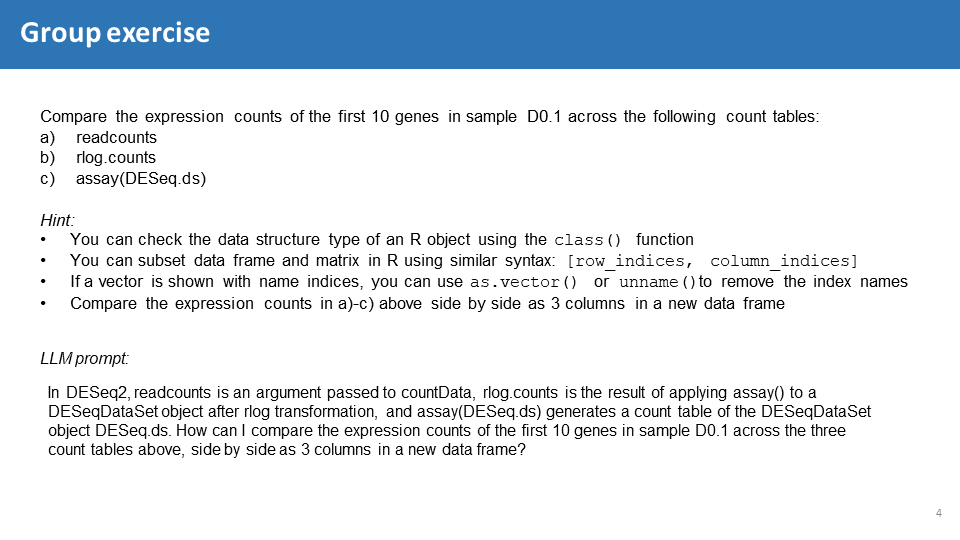
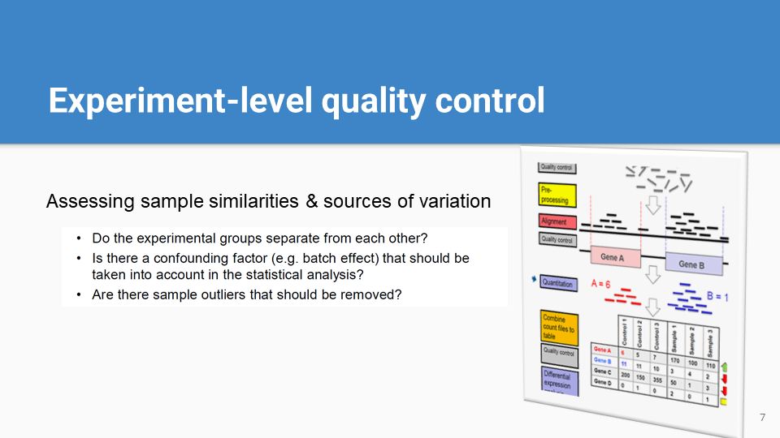
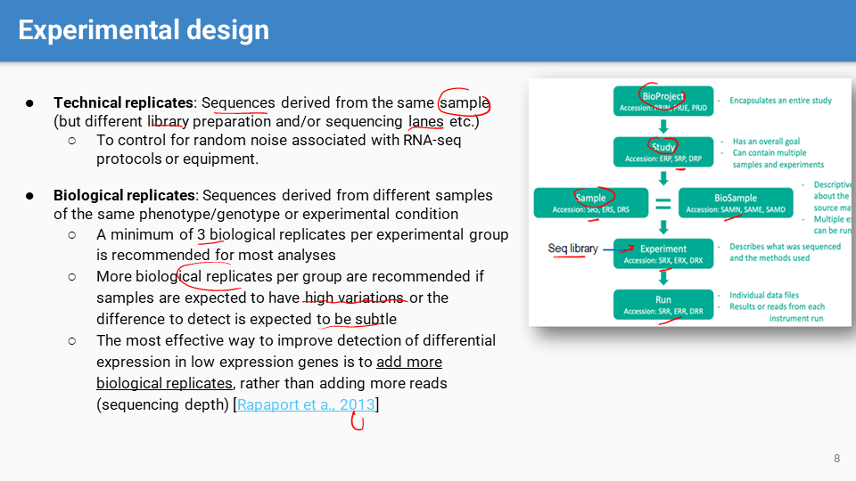
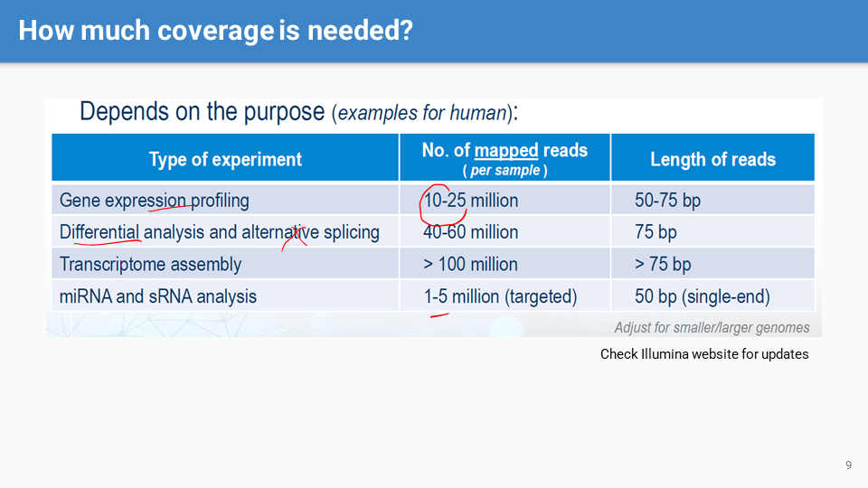
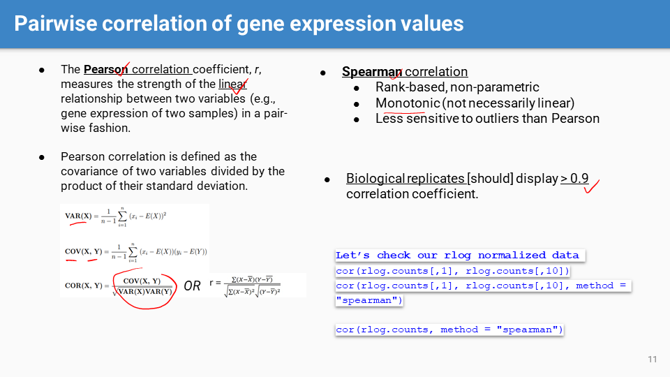
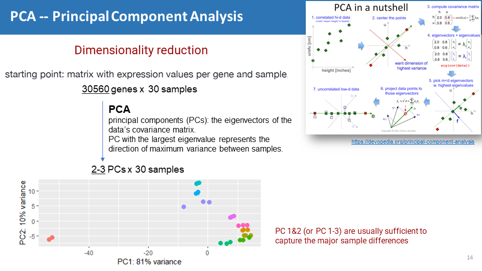

## 11.3 rlog and vst normalization (cont.)
	- 
	- 
		- 
	- 
		- Example of LLMs prompt.
		- When formulating a #prompt to query #LLMs , keep the following in mind:
			- **Specify what is known**: Present the background information or context related to your query. This sets the stage for the LLM to understand the scope/parameters of the discussion or analysis.
			- **Identify what is missing**, if needed: Clearly delineate the gaps in your knowledge. This guides the LLM towards the area where its computational capabilities should be focused.
			- **Define the task to be performed**: Explicitly state the question you want answered or the task you need the LLM to execute.
			- The specificity of your prompt directly correlates to the relevance and precision of the information you receive in return. Precise prompts tend to elicit more accurate and helpful responses from the model.
			-
	-  #Slido
		- #countData in #DESeqDataSet should only contain  **integer** counts
		-
	- 
	-
- ## 11.4 Experimental-level QC (after rlog/vst normalization)
	- 
	- 
	- #[[technical replicates]] helps ensure that the variability observed is due to biological differences rather than technical error.
	- #[[biological replicates]] are crucial for capturing biological variability and are necessary to draw reliable conclusions from experiments.
		- more biological replicates increase the power and robustness of statistical analysis.
		-
	- 
		- The number of reads required for different types of RNA-seq experiments: the exact numbers may vary based on the experiment's goals, the complexity of the genome, and the depth of analysis required.
		-
	- 
	- 
		- Two common statistical methods for measuring #correlation: #Pearson and #Spearman
		-
	- 
	-
	- 
		- #[[hierarchical clustering]] is commonly used in the analysis of gene expression data to identify clusters of samples that exhibit similar expression profiles.
		- Note the use of a #distance measure based on pairwise #correlations to perform hierarchical clustering, which will result in a #dendrogram.
		- The #dendrogram visualizes the relationships between samples, with the #height of the branches reflecting the #distance or dissimilarity between samples or clusters.
		-
	- 
		- to be explained in the next lecture
-