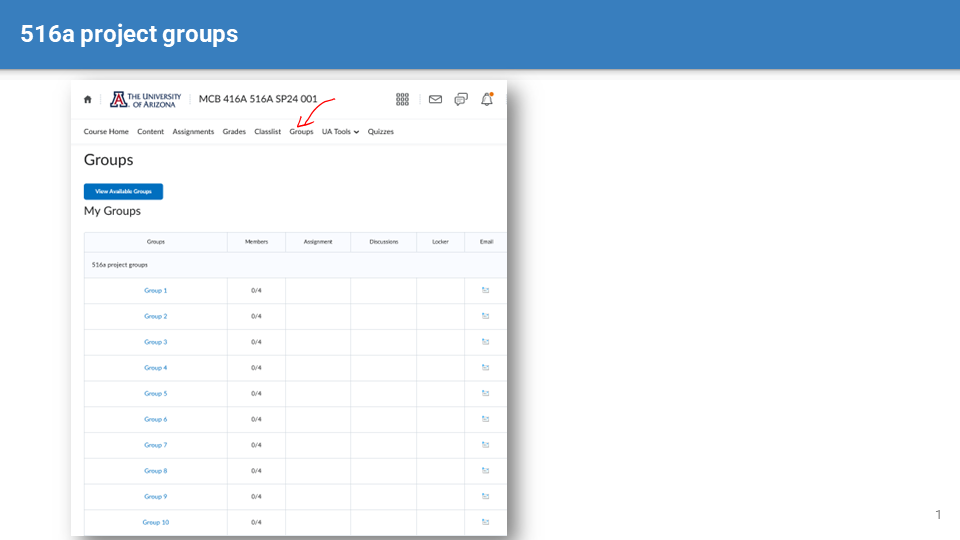
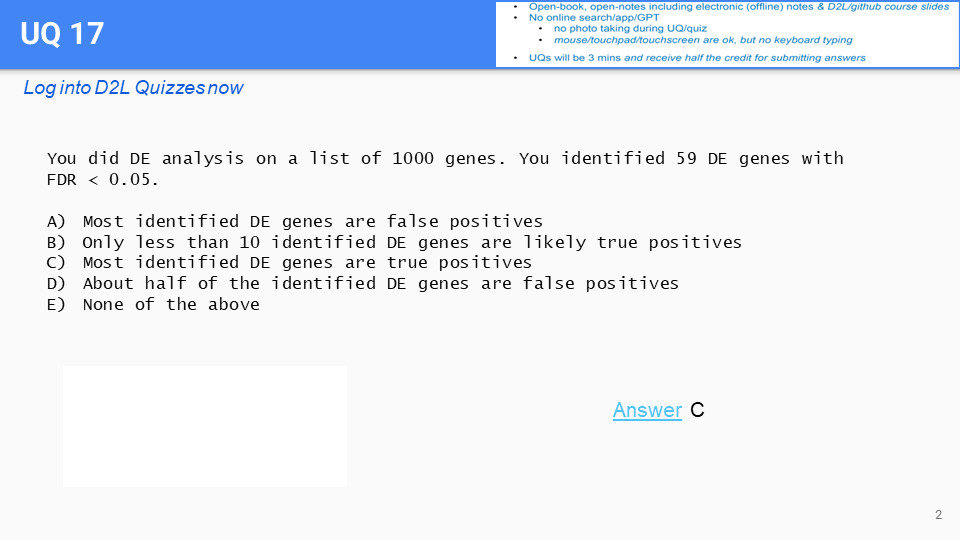
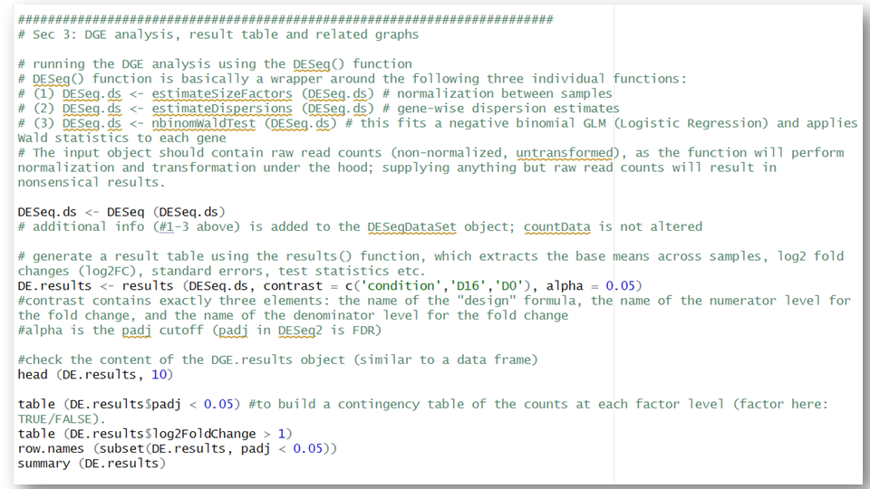
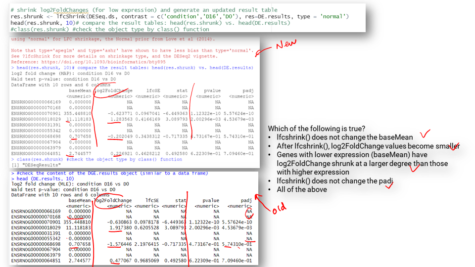
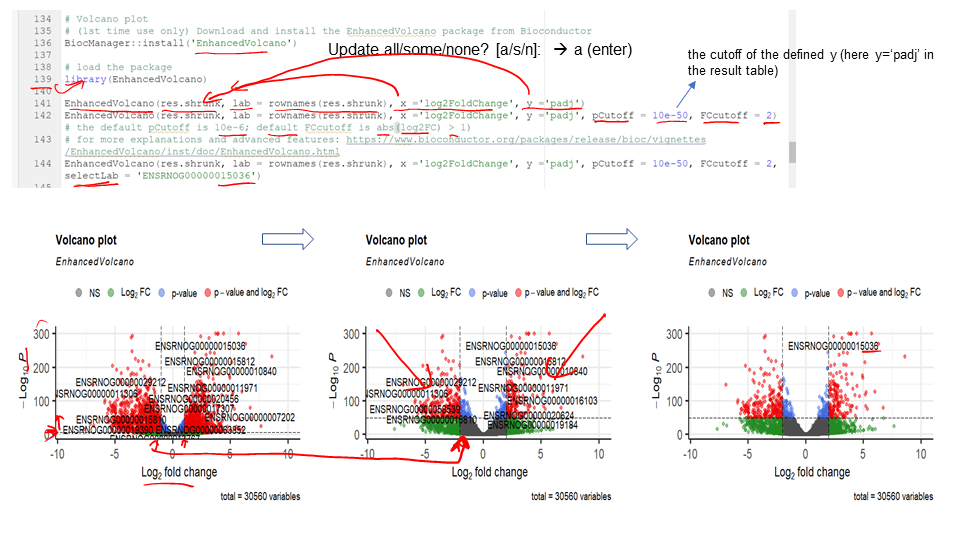
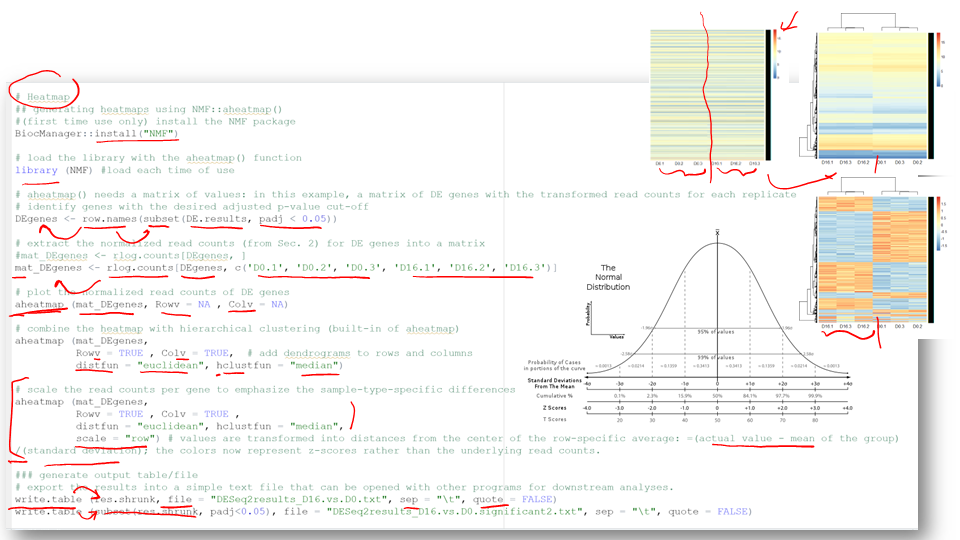
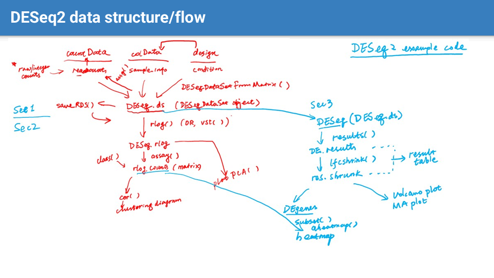

-
	- 
	-
	-  #UQ
	-
	- 
	- 
		- After DESeq(), the #lfcshrink() function can be used to further apply a shrinkage algorithm to the LFC estimates, pulling them towards zero or a specified prior log2 fold change (e.g., in the "apeglm" estimator). This is done using empirical Bayes methods.
			- There are different shrinkage estimators available in DESeq2, such as "apeglm", "ashr", and "normal", each with its own assumptions and characteristics. The choice of the estimator depends on the specific characteristics of the data and the biological question of interest. (we use normal as default in our example code).
			- Note that LFC shrinkage is optional and may not always be necessary, especially if the sample size is really large. However, in most cases, shrinkage can improve the reliability and interpretability of the differential expression results.
			-
	-  #Slido
	-
	- 
		- #MA plot: the log2 fold change (M) against the average expression of genes (A) for the two conditions being compared (as defined in `contrast`)
		-
	- 
		- Note how is the #EnhancedVolcano function customized to change the displaying labels, adjust padj and log2 fold change thresholds, and label specific genes of interest.
		-
	- 
		- A #histogram is generated in this example to visualize the frequency of genes at different `padj` levels
		-
	- 
		- #heatmap here represents the expression patterns of differentially expressed genes across multiple samples.
			- Note how the #Z-score is used to show the standardization of gene expression data, where each row is scaled to have a mean of zero (mean-centered) and a standard deviation of one. The resulting Z-scores indicate how many standard deviations a value is away from the mean, which is a common approach for visualizing data in heatmaps.
				- Also note that the Z-score does not necessarily indicate the fold change magnitude (a DE gene may have a large Z-score but small fold change, e.g., with a large sample size).  ==It's important to consider both the fold change level and the statistical significance== (as indicated by the Z-score or adjusted p-value) when interpreting gene expression data.
		- the function #write.table can be used to export the DESeq2 analysis results to a text file for downstream analysis.
		-
	- 
		- If opening the output table using Excel, note that the 1st row (column names) will be misaligned and needs to be right-shifted by one column.
		-
	- 
		- 
		- Make sure you understand the DESeq2 data structure and analysis flowchart regarding how each step is connected and the order in which different functions and analyses are performed.
			- Learn to modify the code and comments within the script to suit your needs, similar to how one might alter a recipe while cooking.