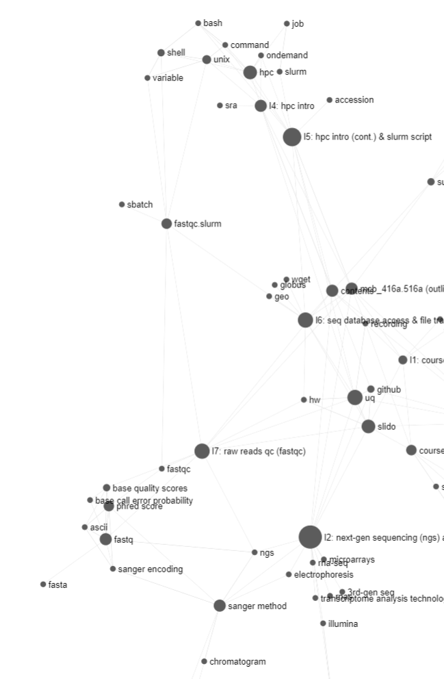

## Cont. from L6
	-  #Slido
	-  #HW 1 (QnA)
	-  #UQ 4
	-  #UQ 5
- # Section 5: Sequencing reads QC (cont.)
	- 
		- Various software tools are available for the quality control and preprocessing of sequencing data.
			- #FastQC: A widely-used tool for assessing the quality of raw sequencing data, providing a modular set of analyses to report on data quality and potential issues. More info at: [http://www.bioinformatics.babraham.ac.uk/projects/fastqc/](http://www.bioinformatics.babraham.ac.uk/projects/fastqc/)
	-  #FastQC.slurm
		- An example SLURM script to run FastQC on HPC
		- Line 3-12: #SBATCH directives for HPC resource allocation
		- Line 14-33: the fastQC job description
			- Defining and using a #variable in #UNIX #shell scripting:
				- Define a variable by simply assigning a value (in quotes) to a name without spaces around the equals sign: `variable_name="value"`
				- Access the value of a variable by using a dollar sign `$` before the variable name: `$variable_name`
			- Note the commands used to load the #FastQC module and execute the analysis (by defining the input file paths and the output directory)
	- 
		- Check the #fastQC output files
			- The html file needs to be downloaded to your local computer to view in a browser
	- 
		- FastQC Report- Per base sequence quality (see S15 for detail)
	- 
		- The structure of a #FASTQ file (the standard format for #NGS data).
			- four lines per sequence entry: the identifier line, the raw nucleotide sequence, a separator (often a '+'), and the corresponding #[[base quality scores]] (Q) in #ASCII symbols
				- The base quality scores are ASCII-encoded, representing the probability of an incorrect base call.
			- FASTQ is basically the traditional #FASTA format (as you see in GenBank) plus the per-base quality scores
	- 
	- 
	- 
		- #[[base quality scores]] in #[[Phred score]] and #ASCII formats
			- #[[base call error probability]] (P) is converted, using a negative logarithmic transformation, into a Phred score = `-10*log10(P)`
				- a higher Phred score indicates a lower base call error probability, thus a higher quality of the base call.
					- (The Phred score system was developed by Brent Ewing, David Hillier, and Phil Green at the University of Washington during the 1990s, as part of the Human Genome Project, to provide a standardized measure of the quality of DNA sequencing.)
			- Phred score is then encoded as ASCII symbols representing #FASTQ's quality scores
				- A popular encoding system is #[[Sanger encoding]]: Phred score + 33 -> ASCII symbol
					- Adding 33 is because the ASCII symbols (0-32) are unprintable control codes
					- (ASCII (American Standard Code for Information Interchange) assigns to each symbol a unique number, which can be represented in decimal (DEC), octal (OCT), hexadecimal (HEX), and binary (BIN) formats.)
					- (#[[Sanger encoding]] was named in honor of Frederick Sanger,  a British biochemist who won the Nobel Prize in Chemistry twice and renowned for developing the #[[Sanger method]] of sequencing)
			- The range for Phred score used in sequencers is typically 0-40
			- Note the relationship between #[[base call error probability]] P and Phred score Q:
				- `Q = -10*log10(P)`
				- `P = 10^(Q/(-10))`
				- Q here refers to Phred score Q, not ASCII quality score Q (as in FASTQ)
	-  #Slido
	- 
		- Different #encoding systems for #[[base quality scores]]
			- Sanger (Phred+33)
			- Solexa and earlier Illumina versions (Phred+64)
			- Illumina (v1.8 and newer):  Phred+33
	- 
		- #FastQC Report- Per base sequence quality
			- the quality (#[[Phred score]], y-axis) of sequencing reads at each base position (x-axis) across all reads.
				- Green region: Very good, with Phred score > 28 (Q28)
				- Orange region: OK/reasonable, with Phred score > 20 (Q20)
				- Red region: Poor/bad, with Phred score < 20 (Q20)
	- 
		- #FastQC Report- Per sequence quality scores
			- the distribution histogram of the following: the mean #[[Phred score]] of each sequencing read (in a FASTQ file)
	-  #Slido
	- 
		- #FastQC Report- Per Base Sequence Content
			- the proportion of each base (A, T, G, C) at each position across all reads. It can help identify issues like sequencing bias or contamination.
	- 
		- More #FastQC report modules: [http://www.bioinformatics.babraham.ac.uk/projects/fastqc/Help/3%20Analysis%20Modules](http://www.bioinformatics.babraham.ac.uk/projects/fastqc/Help/3%20Analysis%20Modules/)
	- 
		- We will re-explain this slide in the next class
-
- L7 #[[Concept Graph]] {:height 1000, :width 649}