## Cont. from L7
	- 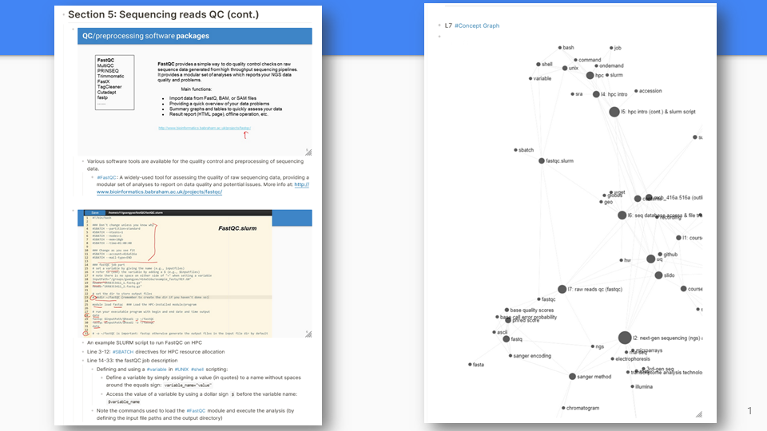 #Github
	-
	- 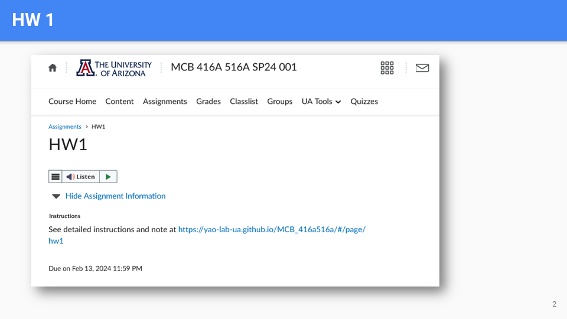 #HW1
		- Search HW1 in #Github course page
			- https://yao-lab-ua.github.io/MCB_416a516a/#/page/hw1
			-
	- 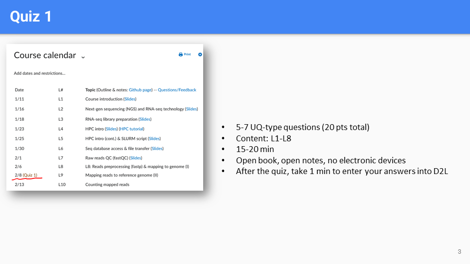 #Quiz 1
	-
	- 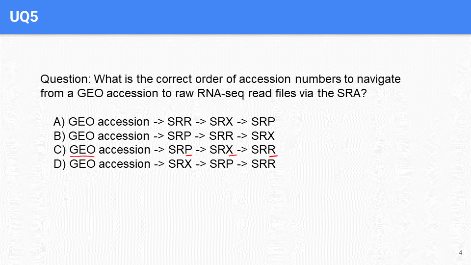 #UQ 5
	-  #UQ 6
-
- # Section 6: Raw reads preprocessing (filtering/trimming)
	- 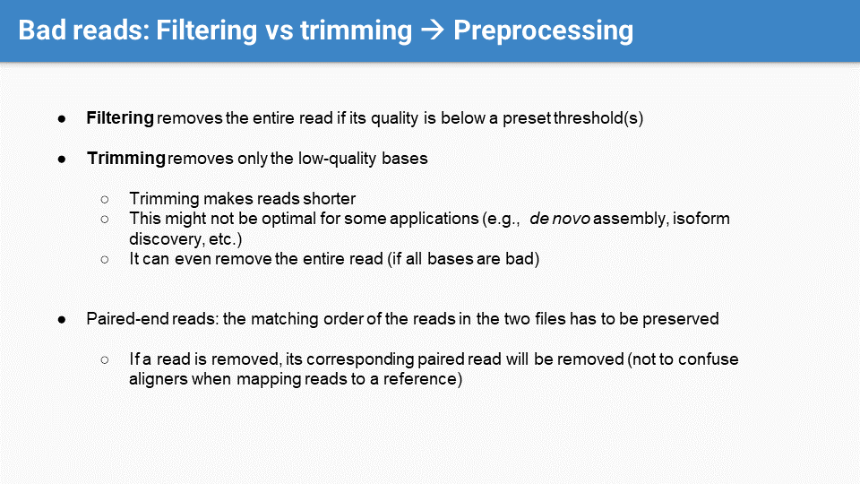
	- 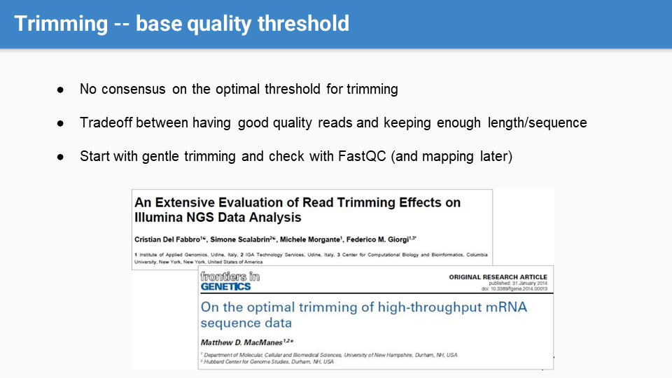
	- 
		- Multiple programs are available for raw reads #preprocessing (#filtering and #trimming); we will introduce and use #fastp
		-
	- 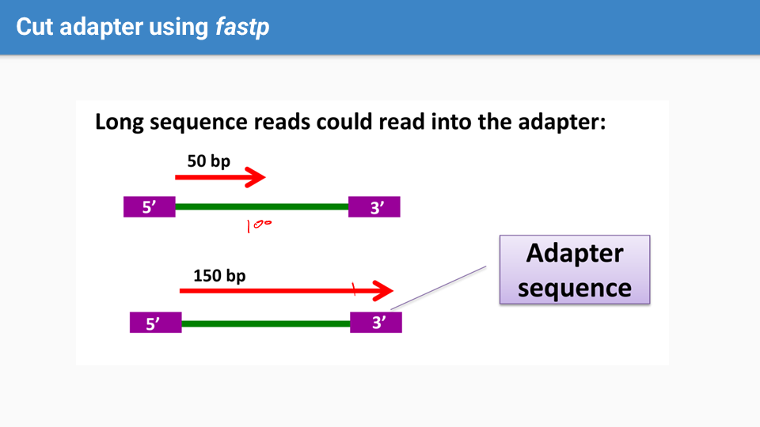
		- When the sequencing read length > cDNA #insert length, the read sequence will include some #adapter sequence
		-
	-  #fastp #script
		- `-5` and `-3` only check and trim the sequences at each end, respectively
		- `-r` goes through the seq from the 5' until hitting a bad window (and then drops all the seq from there to the 3' end)
		- `-5 –r`: trimming the 5' end first, then applying `-r` to the remaining seq
		-
	- 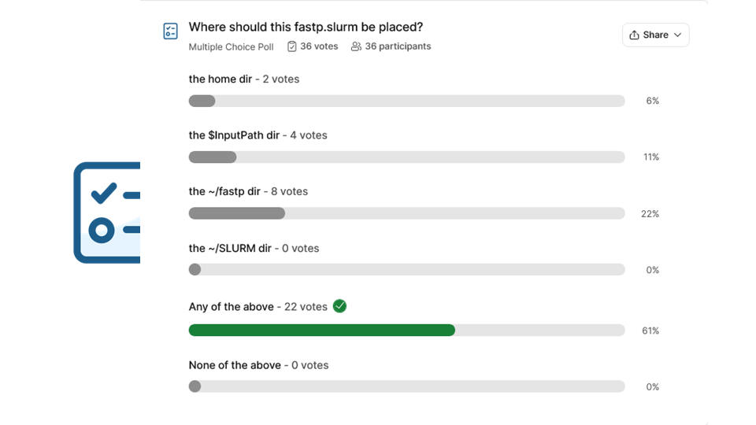{:height 430, :width 750}
		- What if the full path to the output dir is not specified in the slurm script?
		-
	- 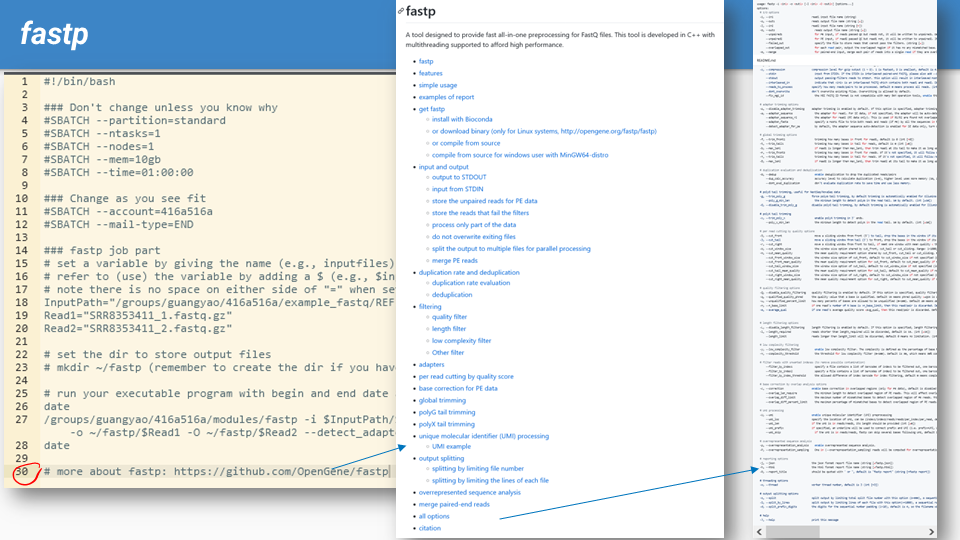
		- FYI (more about #fastp )
		-
	- 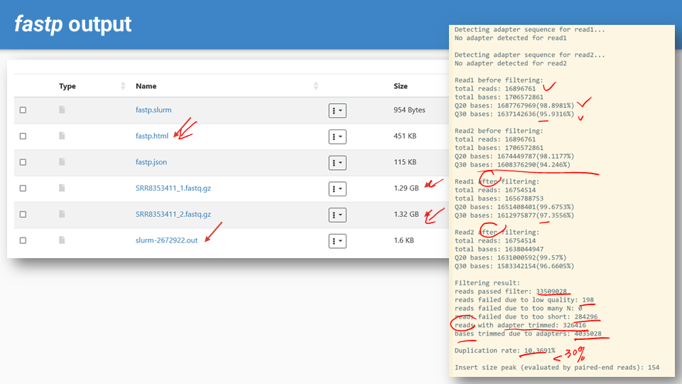
		- #duplication rate refers to the percentage of sequencing reads that are duplicates of other reads. Duplication can be due to the presence of highly expressed transcripts, or PCR amplification step during library prep, or other factors. High duplication rate (> 30% in RNA-seq) may indicate low library complexity.
			- reads originating from different parts of the same transcript are not considered duplicates
			-
	- 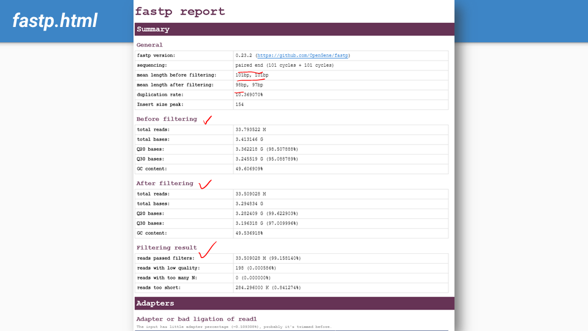
		- compare the information shown in fastp.html vs. slurm-jobID.out, the two #fastp report files
		-
	- 
	- 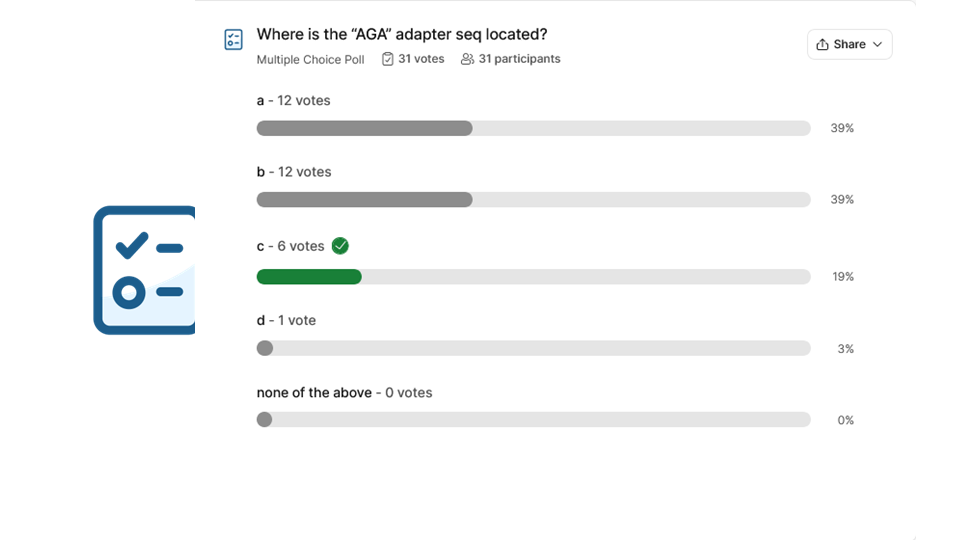
	- 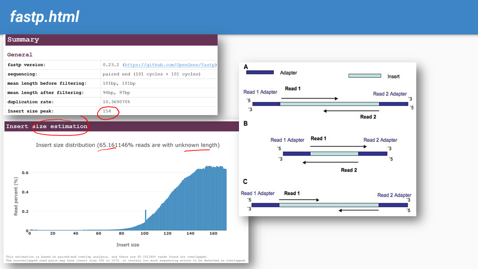
	- 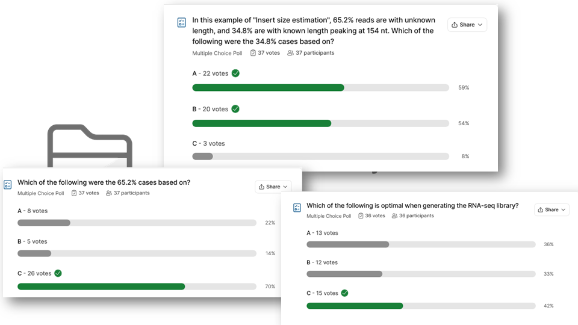
	- 
		- A general guideline is that the length of the #insert exceeds the length of two reads combined (to maximize the unique seq obtained), or at least longer than any read (to avoid reading into the #adapter ).
			- For instance, for 2x100PE (paired-end sequencing with 100 nt reads), the library preparation protocol should generate insert sizes preferably longer than 200 nt, which corresponds to fragments longer than 320 nt, if 60 nt long adapters are used.
			-
	- 