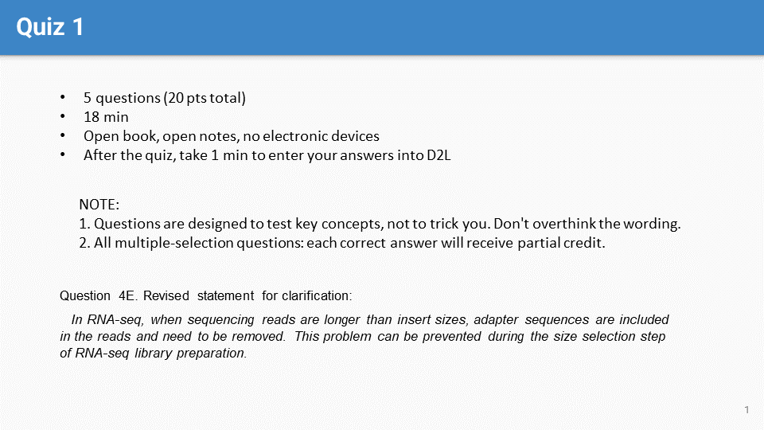
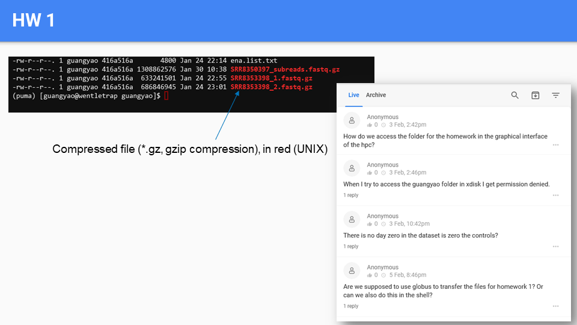
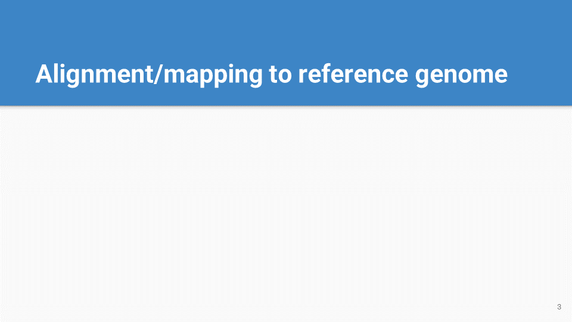
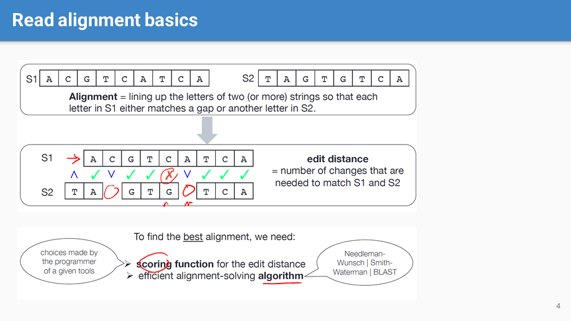
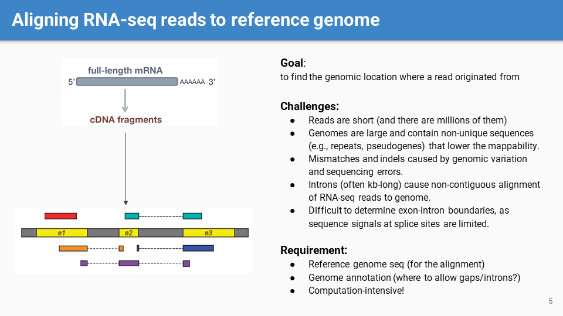
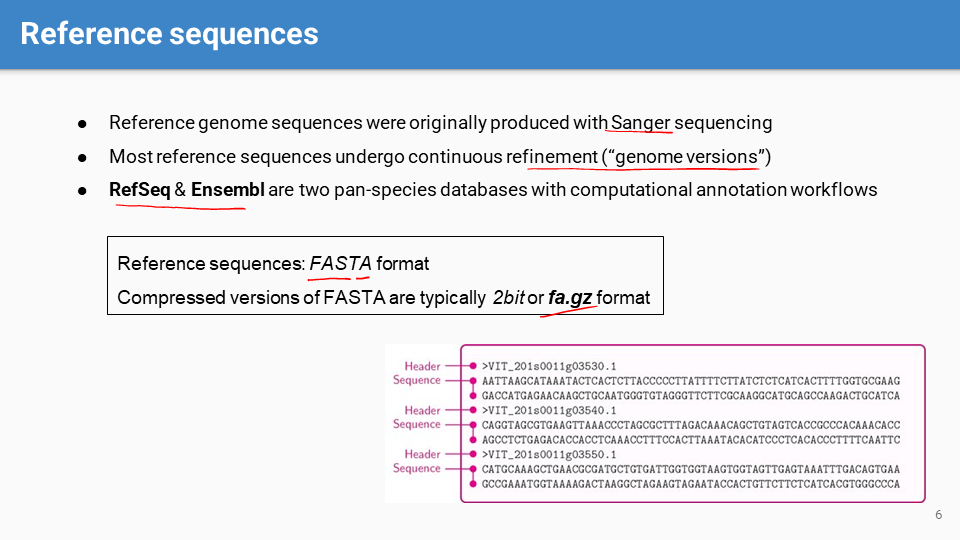

## Cont. from L8
	-  #Quiz 1
	-
	-  #HW1
	-
	- 
	- 
		- #alignment refers to the arrangement of two (or more) strings (sequences) so that each letter in one string matches a letter or a gap in the other.
			- The edit distance is a measure of the number of changes needed to convert one string into the other, indicating how similar they are.
				- (Edit distance can be calculated through various methods, such as by counting the minimum number of insertions, deletions, and substitutions required to change one sequence into the other)
			- Optimal alignment requires a scoring function for calculating the edit distance and an efficient alignment algorithm.
				- (The scoring function typically involves penalties for mismatches and gaps. The exact values used for these penalties can greatly affect the resulting alignment.
				  Algorithms like Needleman-Wunsch and Smith-Waterman are dynamic programming algorithms that ensure optimal alignment but are computationally intensive. BLAST, on the other hand, is a heuristic method that finds local alignments efficiently.)
			- (Alignment is critical in bioinformatics for various applications including identifying homologous genes, studying genome rearrangements, etc., in addition to mapping reads in sequencing projects)
	-
	- 
		- The goal, challenges, and requirements to align RNA-seq short reads to a #[[reference genome]]
		-
	- 
		- #[[reference genome]] sequence
			- The continuous refinement of reference sequences is due to ongoing discoveries and updates in gene structures, variants, and annotations.
			- (RefSeq (Reference Sequence Database) is a project by the National Center for Biotechnology Information (NCBI, USA) that provides a comprehensive, integrated, and well-annotated set of sequences, including genomic DNA, transcripts, and proteins. RefSeq sequences are curated to ensure they represent a non-redundant set.)
			- (Ensembl is a genome browser that provides both automated and, for selected species, manual curation of gene annotations. It is a project based at the European Molecular Biology Laboratory (EMBL)'s European Bioinformatics Institute (EMBL-EBI), located on the Wellcome Genome Campus in Hinxton, UK)
			-
	-  #Slido
	-
	- 
		- #annotation is a dynamic process essential for understanding the biological implications of sequencing data, including the identification of gene regions, regulatory elements, and non-coding RNA, etc.
			- Various annotation formats exist, including GFF2, GFF3, GTF, BED, SAF, etc.
		-
	- 
		- showing the complexity of RNA variations that are not captured in reference genome sequences or annotations.
			- #TSS: transcription start sites
		-
	- 
		- RNA-seq data is particularly challenging due to splicing. Reads spanning exon-exon junctions will not align contiguously to the genome, necessitating the use of #splice-aware alignment algorithms
		-
	- 
	- 
		- Two main functional modules of #STAR: generating a genome index and aligning reads to the reference genome.
		-
	- 
		- #STAR #script
			- Examples of setting variables for invoking the STAR command with various options such as specifying the number of threads, genome directory, and input/output file paths
			-
	- 
	- 
	- 
		- #STAR output
			- The "Log.final.out" is a summary log file that includes important statistics about the alignment process, such as the number of input reads and the percentage of reads that were successfully/uniquely aligned, etc.
				- reads mapped to multiple loci may indicate reads coming from repetitive regions.
				- reads that didn't map because they were too short or had too many mismatches my suggest issues with read quality or an inappropriate choice of alignment parameters.
			-
	- 
	- 
		- #STAR output
			- "Aligned.sortedByCoord.out.bam" is the main output file containing the aligned reads in BAM format, which is sorted by the coordinate in the genome, making it suitable for many downstream analyses.
			- slide 18 explains the structure of #SAM (Sequence Alignment/Map) and #BAM (Binary Alignment/Map) files, which are standard formats for storing large nucleotide sequence alignments.
				- The SAM format is human-readable, tab-delimited text
				- The BAM format is a binary version of SAM that is more compact and faster for computers to process.
				-
	- 
		- #CIGAR (Concise Idiosyncratic Gapped Alignment Report) string is a compact representation of an #alignment
			- It summarizes how matches, mismatches, insertions, deletions, and other events are encoded in the CIGAR string, which is crucial for interpreting detailed alignment information, such as where reads align to the reference and how they differ from it
-